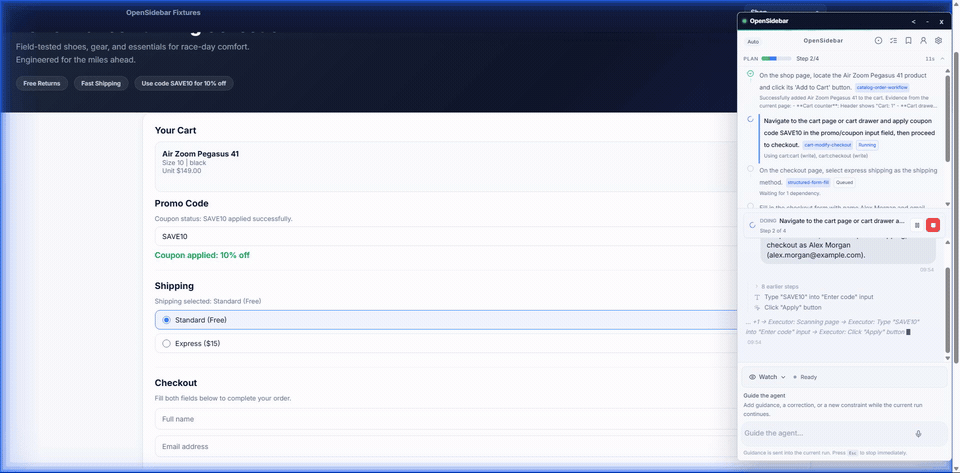
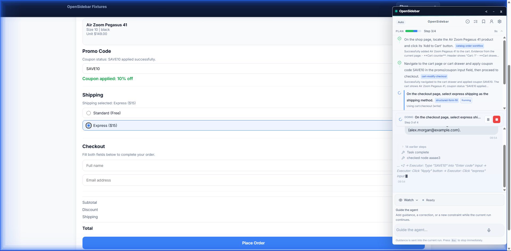

<p align="center">
  
</p>

<h1 align="center">OpenSidebar</h1>

<p align="center">
  <a href="https://opensidebar.com"></a>
  <a href="https://github.com/krisshkodrani/OpenSidebar/actions/workflows/ci.yml"></a>
  <a href="LICENSE"></a>
  <a href="https://nodejs.org/"></a>
</p>

<p align="center">
  Your browser, driven by AI. OpenSidebar is an open-source Chrome extension that puts an autonomous agent in your side panel —<br />
  describe a task in plain English and it sees the page, clicks, types, and carries multi-step work across tabs to done.<br /><br />
  Bring your own API key. No subscription, no telemetry, no backend of ours — the extension runs in your browser and talks only to the model providers you configure.
</p>

<p align="center">
  <a href="https://opensidebar.com"><b>Website &amp; demos</b></a> ·
  <a href="#quick-start">Quick start</a> ·
  <a href="https://github.com/krisshkodrani/OpenSidebar/tree/main/docs">Docs</a> ·
  <a href="#for-developers">Contribute</a>
</p>

<p align="center">
  <a href="https://opensidebar.com"></a>
</p>

---

## Demos

See OpenSidebar drive real tasks end-to-end — no integrations, no scripts. Powered by **Kimi K2.7 Code** (executor, vision) and **GLM 5.2** (planner) on **Fireworks AI**.

### On the open web

Shopping checkout, a job application, a multi-step onboarding wizard, reading data on one page to draft an email on another, and pulling a record from a directory.

https://github.com/user-attachments/assets/84ade244-84cc-4343-a01b-9caf76aeda0c

### Extendables — ServiceNow

The same agent driving a specific enterprise app: order from the service catalog, read a dashboard chart, filter and sort lists, and search the knowledge base.

https://github.com/user-attachments/assets/1ebc2dfc-e1ee-4d6c-9e26-2a4f2e783a0b

<sub>Recorded live. Source clips: <a href="https://github.com/krisshkodrani/OpenSidebar/issues/72">#72</a>.</sub>

## What It Does

OpenSidebar runs an autonomous agent loop inside a Chrome side panel: it perceives the page through a live screenshot and a DOM snapshot, reasons about the next action, executes browser tools, and verifies progress until the task is done. For harder tasks, a planner decomposes the goal into subtasks, an executor drives each step, and a verifier confirms completion before moving on — the full run flow is diagrammed in [docs/run-flow.svg](docs/run-flow.svg).

<p align="center">
  
</p>

## Highlights

- **Sees the page like you do.** The executor is a vision model that works from the live screenshot plus a DOM snapshot — it reads charts, zooms into fine print with `inspect_region`, and handles pages that defeat pure-DOM bots (canvas widgets, closed shadow DOM).
- **52 browser tools.** Clicking, typing, and scrolling — but also file upload and download, tab and window management, structured table/chart/filter extraction, and prose composition delegated to a dedicated writer model. See the [Tools Reference](./docs/features/tools.md).
- **Safe by default.** Approvals are on by default and range from ask-before-every-action to fully autonomous. Consequential actions — submitting a job application, sending a message — pause for your approval. When the agent works from a draft you approved, the final submit is checked field-by-field against that draft, and high-risk completions are re-checked by a judge model before the agent calls a task done.
- **Plans, executes, verifies.** A planner decomposes hard tasks, an executor drives each step, and a verifier confirms completion — with automatic escalation to a stronger model when a run gets stuck instead of burning turns.
- **Remembers what matters.** A local personal profile you review yourself (sensitive fields are consent-gated and encrypted at rest), per-site skills you record once and reuse, and checkpoints that let tasks survive service-worker restarts. See [Personal Profile](./docs/personal-profile.md).
- **Yours to inspect.** Every session produces a full-fidelity trace you can replay in the built-in [trace viewer](#trace-viewer). API keys live in Chrome storage; traffic goes from your browser to the providers you configure — your LLM provider, plus Groq if you enable voice — and nothing else.
- **Speak or type.** Add a Groq API key and voice input transcribes straight into the composer (Whisper large-v3-turbo).
- **Extendable.** Optional OpenClaw "brain" integration (default-off) exposes the browser as thick MCP tools to an external agent. See the [CHANGELOG](CHANGELOG.md) and `docs/engineering/` RFCs.

## Quick Start

### Prerequisites

- Node.js 22+
- A supported provider API key

### Install

```bash
git clone https://github.com/krisshkodrani/OpenSidebar.git
cd OpenSidebar
corepack enable
corepack pnpm install
corepack pnpm run dist
```

### Load in Chrome

1. Open `chrome://extensions/`
2. Enable **Developer mode**
3. Click **Load unpacked**
4. Select the `dist/` folder

### Configure

1. Open the side panel.
2. Open **Settings**.
3. Add the provider key you want to use.

Recommended BYOK modes include Fireworks, OpenRouter, Moonshot/Kimi, and Xiaomi MiMo. See [Providers](./docs/providers.md) for the full provider matrix, key requirements, and failure expectations.

Developing or contributing? See [For Developers](#for-developers) below.

## Safety & Privacy

- Interaction settings range from ask-before-every-action to fully autonomous; high-risk tools can always require explicit approval.
- API keys are stored locally in Chrome storage and only sent to the providers you configure. No telemetry, no analytics, no hosted relay.
- Sensitive personal-profile data is consent-gated and encrypted at rest.
- This is an OSS BYOK preview; review [Known Limitations](./docs/known-limitations.md) before using it on sensitive sites.
- See [SECURITY.md](./SECURITY.md) and [PRIVACY_POLICY.md](./PRIVACY_POLICY.md).

## For Developers

Use package scripts through Corepack-managed pnpm for day-to-day work; Nx is the internal task runner behind those scripts. The examples below assume `corepack enable` has activated the pinned pnpm version from `package.json`.

### Main commands

```bash
pnpm run dev                  # Local services + trace viewer + loadable dev extension in dist-dev/
pnpm run dist                 # Standalone production/manual extension build into dist/
pnpm test                     # Extension unit/integration tests
pnpm run verify               # Lint, typecheck, tests, build, and dist check
pnpm run release:verify       # Release gate plus production dependency audit
pnpm run release:package      # Build dist/ and create zip, checksum, notes, manifest
pnpm run release:preflight    # Validate release artifacts before tagging
pnpm run release:smoke:native-panel # Assisted native Chrome side-panel smoke
pnpm run doctor               # Local setup diagnosis
```

Use `pnpm run dev` while working. When it prints the CRXJS instruction, load `dist-dev/` as the unpacked extension and keep the dev shell running. It includes the local log server and trace viewer at `http://127.0.0.1:7589/viewer`, plus the Vite/CRXJS dev process. Use `pnpm run dist` when you want a standalone extension build in `dist/`.

Advanced commands:

```bash
pnpm run build                # Production extension build
pnpm run lint                 # ESLint
pnpm run typecheck            # TypeScript project checks
pnpm run e2e                  # Normal staged browser E2E sequence
pnpm run traces:compact       # Backfill SQLite, then delete raw traces older than 7 days
pnpm run fmt                  # Prettier
```

The package scripts are thin entry points over Nx targets. Use Nx directly when you want to run one target or project explicitly:

```bash
pnpm exec nx run extension:dev
pnpm exec nx run extension:build
pnpm exec nx run extension:test
pnpm exec nx run-many -t lint
pnpm exec nx run-many -t typecheck
```

### Testing

- Use staged E2E runs by default:
  - `pnpm run test:e2e:smoke` for cheap confidence on core browser-agent behavior
  - `pnpm run test:e2e:interactions` for page interaction and navigation regressions
  - `pnpm run test:e2e:runtime` for orchestration, continuation, recovery, and memory regressions
- Use `pnpm run test:e2e` or `pnpm run test:e2e:staged` for the normal budgeted sequence: smoke, interactions, then runtime.
- Use the WorkArena scripts directly for real benchmark preparation and handoff runs, for example `pnpm exec tsx scripts/workarena-doctor.ts` and `pnpm exec tsx scripts/workarena-handoff.ts --task workarena.servicenow.all-menu --seed 0 --allow-servicenow-reset`.
- Generated E2E reports are written locally under `.artifacts/e2e/`.

### Measured performance

We benchmark on a neutral public set — [Online-Mind2Web](https://huggingface.co/datasets/osunlp/Online-Mind2Web)
(verified live-web tasks, WebJudge auto-eval) — rather than only internal
fixtures, so the number means something outside this repo. The adapter is in
`scripts/bench/` (see [`scripts/bench/README.md`](scripts/bench/README.md)).

```bash
pnpm run bench               # headed sweep on the bundled read-only sample → prints a score
pnpm run bench:fetch         # vendor the official task set (needs HF_TOKEN; dataset is gated)
pnpm run bench -- --size 100 # a 100-task stratified sweep once the official set is vendored
```

Each sweep writes a re-openable receipt per task plus `report.md` / `summary.json`
under `.artifacts/bench/`. Scores are reported per model config
(`E2E_PROVIDER` / `E2E_MODEL`) with cost, the easy/medium/hard breakdown, and a
judge-vs-manual disagreement check alongside the headline rate.

> First full-sweep numbers land shortly after launch — published with receipts
> (per-task judge outputs), not cherry-picked. Write-mutating tasks are skipped
> on the live web and counted as skipped, not failed.

### Harness and skill philosophy

OpenSidebar uses benchmarks and fixtures to expose missing general browser-agent capabilities, not as targets for one-off shortcuts. The harness should stay thin: it can reset state, transfer sessions, collect traces, and validate outcomes, but product behavior belongs in the runtime, tools, controllers, prompts, or reusable skills.

For WorkArena and ServiceNow work, the goal is not to hardcode a 100% benchmark pass. The goal is to improve broad workflow classes: menu navigation, form fill and readback, list filters and sorting, dashboard/chart extraction, knowledge search, catalog checkout, multi-tab work, and sincere infeasible-task handling. WorkArena validation is the proof that these general capabilities work.

When a workflow is stable enough to teach, prefer a generic skill with sequencing, evidence expectations, and tool discipline. Site-specific or organization-specific procedures should eventually be user-authored custom skills, not hidden benchmark logic in the harness.

### Repo layout

- [`apps/extension/`](apps/extension/README.md) - browser extension app, side panel UI, service worker, content script, trace viewer, and tests
- `packages/shared-types/` - shared runtime and domain types
- `packages/prompts/` - compiled prompt runtime and generated prompt registry
- `prompts/` - prompt source templates
- `skills/` - reusable runtime workflow guidance and tool-discipline policies
- `scripts/` - repo-level build, observability, and maintenance scripts
- `docs/` - stable product and developer documentation
- `traces/` - local generated trace workspace used by debugging tools and the trace viewer

## Trace Viewer

<p align="center">
  
</p>

Every agent session can be inspected in the built-in trace viewer.

```bash
pnpm run dev
```

Open `http://127.0.0.1:7589/viewer`.

Trace storage is split into a long-lived SQLite viewer store and short-lived raw debug files:

- `.artifacts/trace-index.sqlite` is the trace viewer store.
- `traces/` and `logs/` hold recent raw JSONL/screenshot evidence for local Codex/debug work.
- Raw files default to a 7-day retention window; SQLite keeps the queryable copy.

Maintenance commands:

```bash
pnpm run traces:index                # backfill or repair .artifacts/trace-index.sqlite
pnpm run traces:delete-old           # dry run; default raw-file window is 7 days
pnpm run traces:delete-old -- --apply # delete old raw files after SQLite coverage check
pnpm run traces:compact              # index, then delete old raw files
```

## Documentation

- [Getting Started](./docs/getting-started.md)
- [Architecture Overview](./docs/architecture/overview.md)
- [Runtime Boundaries](./docs/architecture/runtime-boundaries.md)
- [Developer Guide](./docs/developer-guide.md)
- [Agent Loop](./docs/architecture/agent-loop.md)
- [Perception Layer](./docs/architecture/perception-layer.md)
- [Tools Reference](./docs/features/tools.md)
- [WorkArena Roadmap](./docs/evals/workarena-roadmap.md)
- [WorkArena Setup](./docs/evals/workarena.md)
- [WorkArena Major Full Run Checklist](./docs/evals/workarena-full-run-checklist.md)
- [OSS BYOK Launch Roadmap](./docs/oss-byok-launch-roadmap.md)
- [Right Level Of Abstraction](./docs/guides/right-level-of-abstraction.md)
- [WorkArena Generalized Harness Philosophy](./docs/guides/workarena-generalized-harness-philosophy.md)
- [Personal Profile](./docs/personal-profile.md)
- [Release Checklist](./docs/release-checklist.md)
- [Known Limitations](./docs/known-limitations.md)
- [Roadmap](./docs/roadmap.md)
- [Engineering RFCs](./docs/engineering/rfcs/README.md) — active design docs (LP series)
- [Providers](./docs/providers.md)

## License

MIT. See [LICENSE](./LICENSE).
