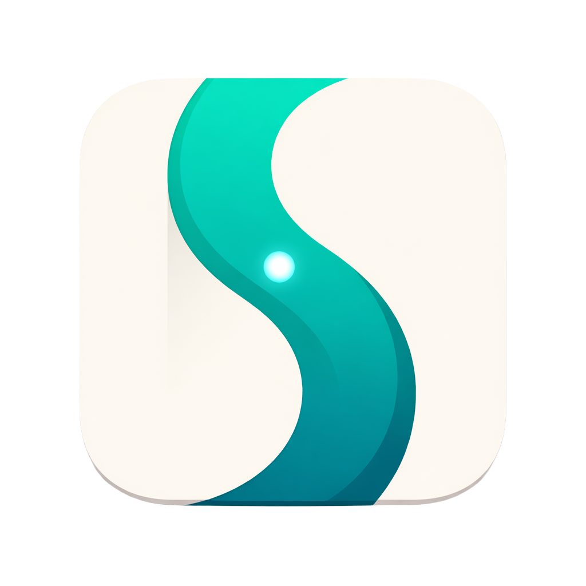

<p align="center">
  
</p>

<h1 align="center">OpenSidebar</h1>

<p align="center">
  <a href="https://github.com/krisshkodrani/OpenSidebar/actions/workflows/ci.yml"></a>
  <a href="LICENSE"></a>
  <a href="https://nodejs.org/"></a>
</p>

<p align="center">
  Open-source Chrome extension that turns your browser into an AI-powered agent.<br />
  Give it a task in plain English and it navigates, clicks, types, and completes multi-step workflows autonomously.<br />
  Bring your own provider key. No subscription, no telemetry, no hosted backend.
</p>

---

## What It Does

OpenSidebar runs an autonomous agent loop inside a Chrome side panel. You describe what you want done, and the agent perceives the page through vision and DOM snapshots, reasons about the next action, executes browser tools, and verifies progress until the task is complete.

For harder tasks, a planner decomposes the goal into subtasks, an executor handles each step, and a verifier confirms completion before moving on.

## Capabilities

**Automation** - Generic browser tools for clicking, typing, scrolling, selecting, tab management, uploads, downloads, and page reading.

**Intelligence** - Two-tier model architecture with automatic escalation, page perception, and recovery when the executor gets stuck.

**Orchestration** - Planner, executor, and verifier lanes for multi-step tasks, with plan confirmation and approval gates.

**Observability** - Full-fidelity traces, structured logs, and a built-in trace viewer.

**Privacy** - API keys stay in Chrome storage. No analytics or hosted relay.

## Quick Start

### Prerequisites

- Node.js 18+
- A supported provider API key

### Install

```bash
git clone https://github.com/krisshkodrani/OpenSidebar.git
cd OpenSidebar
npm install
npm run build
```

### Load in Chrome

1. Open `chrome://extensions/`
2. Enable **Developer mode**
3. Click **Load unpacked**
4. Select the `dist/` folder

### Configure

1. Open the side panel.
2. Open **Settings**.
3. Add the provider key you want to use.

## Development

```bash
npm run dev        # Extension + log server + trace viewer
npm run build      # Production build
npm test           # Unit + integration tests
npm run test:e2e   # Real-browser E2E tests
npm run lint       # ESLint
npm run fmt        # Prettier
```

## Trace Viewer

Every agent session can be inspected in the built-in trace viewer.

```bash
npm run dev
# or
npm run logs
```

Open `http://127.0.0.1:7589/viewer`.

## Documentation

- [Getting Started](./docs/getting-started.md)
- [Architecture Overview](./docs/architecture/overview.md)
- [Developer Guide](./docs/developer-guide.md)
- [Perception Layer](./docs/architecture/perception-layer.md)
- [Tools Reference](./docs/features/tools.md)

## Security & Privacy

- API keys are stored locally and only sent to configured providers.
- No telemetry or analytics.
- High-risk tools can require explicit approval.
- See [SECURITY.md](./SECURITY.md) and [PRIVACY_POLICY.md](./PRIVACY_POLICY.md).

## License

MIT. See [LICENSE](./LICENSE).
