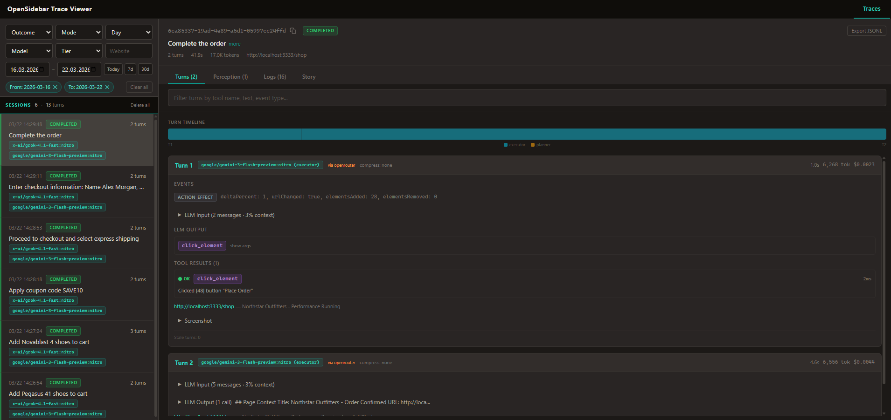
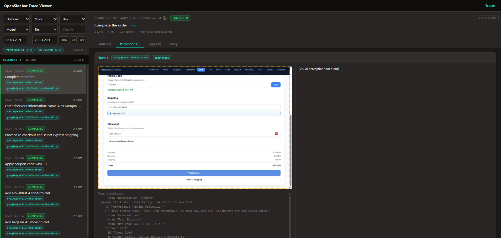
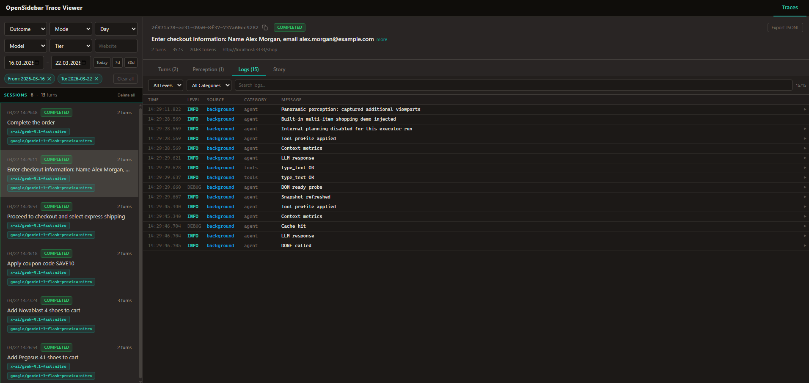

<p align="center">
  
</p>

<h1 align="center">OpenSidebar</h1>

<p align="center">
  <a href="https://github.com/krisshkodrani/OpenSidebar/actions/workflows/ci.yml"></a>
  <a href="LICENSE"></a>
  <a href="https://nodejs.org/"></a>
</p>

<p align="center">
  Open-source Chrome extension that turns your browser into an AI-powered agent.<br />
  Give it a task in plain English and it navigates, clicks, types, and completes multi-step workflows autonomously.<br />
  Bring your own <a href="https://openrouter.ai">OpenRouter</a> key. No subscription, no telemetry, no hosted backend.
</p>

---

<!-- TODO: Upload demo.mp4 to a GitHub Issue, then paste the user-attachments URL here -->

---

## What It Does

OpenSidebar runs an autonomous agent loop inside a Chrome side panel. You describe what you want done — "buy the running shoes, apply coupon SAVE10, use express shipping" — and the agent perceives the page through vision and DOM snapshots, reasons about what to do, executes actions through 38 browser tools, and verifies the result. It repeats this cycle until the task is complete.

For harder tasks, a planner decomposes the goal into subtasks, an executor handles each step, and a verifier confirms completion before moving on. When the executor gets stuck, it escalates to a stronger reasoning model automatically.

Everything runs locally in your browser. The only external calls are to the LLM providers you configure through OpenRouter.

## Capabilities

**Automation** — 38 generic browser tools: click, type, scroll, hover, drag and drop, select, upload files, execute JavaScript, manage tabs, read PDFs, and more. No site-specific code. Works on any website.

**Intelligence** — Two-tier LLM architecture (fast executor + strong planner) with automatic escalation. Vision-backed perception interprets the page visually every turn. Stagnation detection, strategy pivots, and graduated intervention when stuck.

**Orchestration** — Planner decomposes complex tasks into subtasks. Plan confirmation lets you review before execution. Approval gates for sensitive actions. Pause, resume, or stop at any time.

**Observability** — Full-fidelity trace recording of every agent session. Built-in trace viewer with turn-by-turn LLM I/O, tool calls, screenshots, perception output, token usage, and cost. Structured logs. Offline eval pipeline with LLM-as-judge scoring.

**Privacy** — API keys stay in Chrome storage. No analytics, no telemetry, no data leaves your browser except LLM API calls to your configured provider.

## Quick Start

### Prerequisites

- Node.js 18+
- An [OpenRouter](https://openrouter.ai) API key

### Install

```bash
git clone https://github.com/krisshkodrani/OpenSidebar.git
cd OpenSidebar
npm install
npm run build
```

### Load in Chrome

1. Open `chrome://extensions/`
2. Enable **Developer mode**
3. Click **Load unpacked**
4. Select the `dist/` folder

### Configure

1. Click the OpenSidebar icon to open the side panel.
2. Open **Settings**.
3. Enter your OpenRouter API key.

## Architecture

```text
Side Panel (React/Zustand) <-> Service Worker (Agent Loop) <-> Content Script (DOM)
```

Three isolated Chrome contexts. The service worker owns the agent loop and orchestrator, the content script reads and manipulates the page, and the side panel renders chat, plans, approvals, and session metrics.

| Component | Default |
| --- | --- |
| Executor | `google/gemini-3-flash-preview` via OpenRouter |
| Executor fallback | `google/gemini-3.1-flash-lite-preview` via OpenRouter |
| Planner | `minimax/minimax-m2.5` via OpenRouter |
| Perception | `x-ai/grok-4.1-fast` via OpenRouter |
| UI | React 18 + Tailwind CSS + Zustand |
| Build | Vite |

All models are configurable in Settings. The Nitro toggle appends `:nitro` for faster inference on supported models.

## Trace Viewer

Every agent session is recorded with full fidelity — DOM snapshots, LLM requests/responses, tool executions, screenshots, perception output, token usage, and cost. The built-in trace viewer lets you inspect everything.

```bash
npm run dev    # starts the extension + trace viewer
# or
npm run logs   # starts just the log server + trace viewer
```

Open `http://127.0.0.1:7589/viewer` to browse sessions.

**Session list with filters and per-turn tool/cost breakdown:**



**Perception view — page screenshot with visual grounding output:**



**Structured logs with level filtering:**



## Development

```bash
npm run dev        # Full dev stack: Vite HMR + log server + trace viewer
npm run build      # Production build
npm test           # Unit + integration tests (Vitest)
npm run test:e2e   # Real-browser E2E tests (requires OPENROUTER_API_KEY)
npm run lint       # ESLint
npm run fmt        # Prettier
```

See [CONTRIBUTING.md](./CONTRIBUTING.md) for the full development guide.

## Security & Privacy

- API keys are stored in Chrome storage and only sent to configured model providers.
- No telemetry or analytics.
- URL sanitization blocks non-http(s) protocols.
- High-risk tools can require explicit approval.
- See [SECURITY.md](./SECURITY.md) and [PRIVACY_POLICY.md](./PRIVACY_POLICY.md).

## Documentation

- [Architecture Overview](./docs/architecture/overview.md)
- [Developer Guide](./docs/developer-guide.md)
- [Perception Layer](./docs/architecture/perception-layer.md)
- [Tools Reference](./docs/features/tools.md)
- [Evals Guide](./docs/guides/evals-program.md)

## License

MIT. See [LICENSE](./LICENSE).
