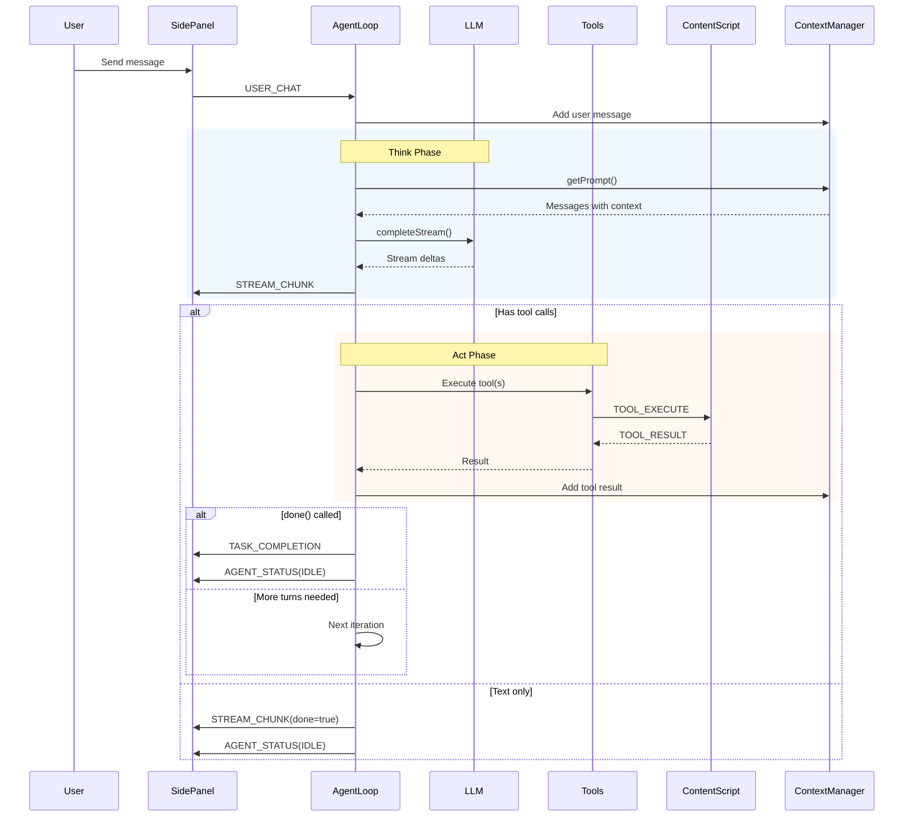

# Agent Loop

The agent loop is the core orchestration engine that runs in the service worker. It manages the Think → Act → Observe cycle, calling the LLM and executing tools.

## Architecture

**Location:** `src/background/agent/`

**Files:**

- `constants.ts` - Centralized configuration constants (thresholds, limits, string lengths)
- `loop.ts` - Main `AgentLoop` class
- `context.ts` - `ContextManager` for conversation history
- `stagnation.ts` - `StagnationMonitor` for stuck detection via snapshot fingerprinting
- `step-labels.ts` - Human-readable step label generation for `AgentStep` timeline
- `executor.ts` - Tool execution logic (parallel/sequential strategies)
- `planner.ts` - `TaskPlanner` for task decomposition and completion validation
- `tool-recovery.ts` - Extract tool calls from plain text LLM responses
- `trace.ts` - `TraceRecorder` for full-fidelity session recording

## AgentLoop Class

The `AgentLoop` orchestrates the entire agent lifecycle:

```typescript
class AgentLoop {
  private llm: LLMClient;
  private context: ContextManager;
  private isRunning = false;
  private abortController: AbortController | null = null;

  async start(
    initialUserText: string,
    tabId: number,
    initialSnapshot?: DomSnapshot,
  ): Promise<LoopResult>;
  stop(): void;
  async resume(
    savedState: AgentLoopState,
    newSnapshot?: DomSnapshot,
  ): Promise<void>;

  // Public API
  injectFeedback(text: string): void;
  getCurrentTurn(): number;
  getOriginalQuery(): string;
  getStagnationMonitor(): StagnationMonitor;
  pause(): void;
  resume(): void;
  isPaused(): boolean;
}
```

## Agent Loop Flow



### Lifecycle

1. **Initialize** - Load API keys, restore context from storage
2. **Add user message** - User's request to context
3. **THINKING** - Call LLM with streaming
4. **ACTING** - Execute tool calls sequentially
5. **OBSERVE** - Add tool results to context
6. **Repeat** until done or max turns reached

### Loop Pseudocode

```typescript
while (isRunning && turns < MAX_TURNS) {
  turns++;

  // 1. Get context window
  const messages = context.getPrompt();
  const tools = toolRegistry.getDefinitions();

  // 2. LLM call (streaming)
  status = THINKING;
  const response = await llm.completeStream({ messages, tools }, (delta) =>
    sendStreamChunkToUI(delta),
  );

  // 3. Add assistant message
  context.addMessage({
    role: "assistant",
    content: response.content,
    tool_calls: response.tool_calls,
  });

  // 4. Handle response
  if (response.tool_calls) {
    status = ACTING;

    for (const toolCall of response.tool_calls) {
      // Check workspace permissions
      if (!workspaceManager.isTabInActiveWorkspace(tabId)) {
        // Return error
      }

      // Execute tool
      const result = await toolRegistry.execute(toolCall, tabId);

      // Add tool result
      context.addMessage({
        role: "tool",
        tool_call_id: toolCall.id,
        content: result,
      });

      // Handle special tools
      if (toolCall.name === ToolName.DONE) {
        status = IDLE;
        return; // Exit loop
      }
    }
  } else {
    // Text-only response
    status = IDLE;
    return; // Exit loop
  }
}
```

## Context Management

The `ContextManager` manages conversation history with sliding window truncation.

### Sliding Window Algorithm

Keeps conversation within token limits while preserving critical context:

1. **Always keep:**
   - System message (index 0)
   - Original user query (index 1) - prevents "Goal Amnesia"
   - N most recent messages

2. **Drop oldest first:**
   - Remove middle messages until under token budget
   - Never drop protected indices

3. **Token estimation:**
   - Uses chars/4 heuristic (~4 chars per token)
   - Fast and accurate enough for context management

```typescript
function applySlidingWindow(
  messages: ChatMessage[],
  config: SlidingWindowConfig,
): ChatMessage[] {
  // 1. Calculate total tokens
  // 2. If under budget, return as-is
  // 3. Identify protected indices (system, goal, recent)
  // 4. Drop middle messages oldest-first
  // 5. Return truncated array
}
```

### Context Persistence

Context survives service worker restarts via `chrome.storage.session`:

```typescript
// On initialization
await context.loadState(); // Restore from storage

// On each message
context.addMessage(msg);
await context.saveState(); // Persist to storage
```

This is critical because Chrome terminates service workers after ~30 seconds of inactivity.

## System Prompt

The system prompt provides instructions and context to the LLM. The agent receives instructions about:

- **Capabilities** - 39 available tools for DOM manipulation, tab management, etc.
- **Rules** - Always call read_page first, use exact numeric tags, call done when complete
- **Vision** - Screenshot analysis via configurable vision LLM

## Streaming

The agent uses Server-Sent Events (SSE) for real-time LLM responses:

### parseSSEStream

Parses SSE stream, accumulating text and tool calls:

```typescript
async function parseSSEStream(
  body: ReadableStream<Uint8Array>,
  onTextDelta: (delta: string) => void,
): Promise<{ content: string | null; tool_calls?: ToolCall[] }> {
  const reader = body.pipeThrough(new TextDecoderStream()).getReader();

  let buffer = "";
  let content = "";
  const partialToolCalls = new Map<number, PartialToolCall>();

  while (true) {
    const { done, value } = await reader.read();
    if (done) break;

    buffer += value;
    const lines = buffer.split("\n");
    buffer = lines.pop() ?? "";

    for (const line of lines) {
      if (!line.startsWith("data: ")) continue;
      const data = line.slice(6).trim();
      if (data === "[DONE]") continue;

      const parsed = JSON.parse(data);
      const delta = parsed.choices?.[0]?.delta;

      // Handle text content
      if (delta.content) {
        content += delta.content;
        onTextDelta(delta.content);
      }

      // Handle tool calls (accumulated across chunks)
      if (delta.tool_calls) {
        for (const tc of delta.tool_calls) {
          const idx = tc.index ?? 0;
          // Accumulate partial tool call...
        }
      }
    }
  }

  // Finalize tool calls and return
}
```

### Streaming Flow

1. LLM API returns SSE stream
2. `parseSSEStream` reads chunks
3. For each text delta, calls `onTextDelta`
4. Background sends `STREAM_CHUNK` to side panel
5. Side panel appends delta to streaming message
6. On completion, finalizes message

## Tool Execution

The agent supports **38 tools** across four categories:

### Content Script Tools (DOM)

- `click_element` - Click tagged element
- `type_text` - Type into input
- `scroll_page` - Scroll up/down (supports container elements via optional `id` param)
- `read_page` - Get page snapshot
- `hover_element` - Hover over element
- `find_element` - Find by text, return tag ID for interaction
- `select_option` - Select dropdown option
- `press_key` - Dispatch keyboard events (with optional modifiers)
- `drag_and_drop` - Full drag sequence between elements
- `hide_element` - Hide element via `display: none`
- `read_element` - Read specific attribute or text content
- `execute_js` - Run JavaScript in page context
- `upload_file` - Upload file to input element
- `right_click` - Right-click on element
- `set_checkbox` - Set checkbox/radio state
- `click_coordinates` - Click at viewport X/Y coordinates
- `inspect_hidden` - Scan for hidden DOM elements

### Tab Tools (Service Worker)

- `navigate` - Navigate to URL (or search query)
- `create_tab` - Open new tab
- `close_tab` - Close tab
- `switch_tab` - Switch to tab
- `list_tabs` - List open tabs in workspace
- `go_back` - Go back in history
- `wait` - Wait for duration

### Browser API Tools

- `get_cookies` - Get cookies for URL
- `set_cookie` - Set a cookie
- `delete_cookie` - Delete a cookie
- `search_history` - Search browser history
- `download_file` - Start file download

### Special Tools

- `done` - Task completion
- `escalate` - Voluntary model upgrade (switch from executor to planner model)

## Safety & Limits

### Max Turns

Default: 25 turns per conversation (slider cap: 500)
Prevents infinite loops and runaway agents

### Workspace Isolation

Each turn checks if tab is in active workspace:

```typescript
const isAllowed = await workspaceManager.isTabInActiveWorkspace(tabId);
if (!isAllowed) {
  return "Error: Tab not in active workspace";
}
```

### Risk Classification

Tools classified by risk level (LOW/MEDIUM/HIGH):

- LOW: Read-only (read_page, scroll_page, list_tabs, etc.)
- MEDIUM: Mutates state (click_element, type_text, hover_element, etc.)
- HIGH: Navigation/tabs (navigate, create_tab, close_tab, escalate, etc.)

Risk is logged and displayed in UI (informational only).

### Abort Handling

User can stop the agent at any time:

```typescript
public stop() {
    this.abortController?.abort();
    this.isRunning = false;
}
```

On abort, loop catches `AbortError` and exits cleanly.

## Navigation Bridge Integration

When `navigate` is called:

1. Save agent state to `chrome.storage.local`
2. Navigate tab to new URL
3. Exit agent loop
4. Wait for `webNavigation.onCompleted`
5. Restore state and resume loop
6. Continue from where it left off

See [Navigation Bridge](./navigation-bridge.md) for details.

## Progress Tracker

The `StagnationMonitor` (`stagnation.ts`) detects when the agent is stuck in a loop by fingerprinting DOM snapshots after each DOM-modifying action. If the snapshot fingerprint doesn't change for multiple consecutive turns, it intervenes:

- **Reflection** (6 stagnant turns): Injects a user message suggesting alternative approaches
- **Pivot** (9 stagnant turns): More aggressive strategy change
- **Escalate** (12 stagnant turns): Fires once, suggests more drastic action changes
- **Subsequent signals** (every 6 turns after): Repeat reflections

Snapshot fingerprinting hashes `url + element count + sorted element signatures (tagName:text:isVisible)`. The tracker broadcasts `AGENT_STAGNATION` messages to the side panel and sends `"resolved"` when progress resumes.

## Perception Layer

The `perception.ts` module provides `perceive()` which sends a screenshot + element summary to a vision model for structured page interpretation. Uses OpenRouter Grok 4.1 Fast. Output is a 6-section format (LAYOUT, STATE, CONTENT, VISUAL-ONLY, BLOCKERS, SPATIAL) at ~150 tokens vs ~4K raw DOM text. Fingerprint-based caching avoids redundant calls.

## Pause / Resume

The agent loop supports pausing via a Promise-based gate:

- `pause()` creates a `pauseGate` Promise and sets status to `PAUSED`
- `resume()` resolves the gate Promise and resumes the loop
- At the top of each loop iteration, if `pauseGate` exists, the loop awaits it
- `isPaused()` checks current state

Users trigger pause/resume via `PAUSE_AGENT` / `RESUME_AGENT` messages from the side panel.

## Feedback Injection

Users can send messages while the agent is running. These are treated as feedback:

- Side panel sends `USER_CHAT` with `isFeedback: true`
- Background routes to `agentLoop.injectFeedback(text)` instead of creating a new loop
- On the next turn, the feedback is appended as a `UserMessage`: `"[User feedback]: {text}"`

## Unified Mode Behavior

The agent loop operates in a single unified mode that combines the best behaviors:

- **Parallel tool execution** — When no sequential tools (navigate, done, escalate, go_back) are present, all tool calls execute via `Promise.all`.
- **Modal auto-dismiss** — Cookie banners and overlay modals are dismissed before the first LLM turn.
- **Two-tier escalation** — Text-only responses trigger reflection→escalate→give-up. The system has two tiers (executor/planner) with a single escalation step. Context distillation compresses history before planner model handoff.
- **Batch snapshot refresh** — A single DOM snapshot refresh runs after all tools complete (not per-tool).
- **Real-time streaming** — Text deltas streamed to side panel during LLM generation.
- **Dynamic compression** — Context compression adjusts dynamically (NONE→LIGHT→MEDIUM→HEAVY) based on token budget.
- **Session metrics** — Real-time token usage and cost tracking.
- **Trace recording** — Full-fidelity session recording for offline evaluation.

## Session Metrics

The agent tracks real-time token usage and cost:

```typescript
interface SessionMetrics {
  totalPromptTokens: number;
  totalCompletionTokens: number;
  totalTokens: number;
  totalCost: number; // USD
  totalLlmTimeMs: number;
  totalSessionTimeMs: number;
  llmCallCount: number;
  totalCachedTokens: number;
  modelBreakdown: Record<
    string,
    {
      promptTokens: number;
      completionTokens: number;
      cost: number;
      calls: number;
    }
  >;
}
```

Metrics are broadcast to the side panel during and after the session.

## Trace Recording

The `TraceRecorder` captures full-fidelity session data for offline evaluation:

```typescript
interface TraceEntry {
  sessionId: string;
  turnNumber: number;
  snapshot: { url; title; elementCount; visibleContentLength; scrollY };
  elements: TaggedElement[];
  llmRequest: { model; messageCount; toolCount; compressionLevel };
  llmResponse: { content; toolCalls; finishReason; usage; durationMs };
  toolExecutions: TraceToolExecution[];
  events: TraceEvent[];
  progressState: { stagnantTurns; signal };
}
```

## Multi-Provider LLM Support

The agent uses a two-tier architecture with independent provider pools for each tier:

### Executor Tier (observe→act cycles)
- **OpenRouter** (`google/gemini-3-flash-preview`)

### Planner Tier (reasoning/escalation)
- **OpenRouter** (`minimax/minimax-m2.5`) — Single provider

Both pools use `ProviderPool` with `PoolConfig` for generic configuration. The `TaskPlanner` also uses the planner pool.

### Context Distillation

On escalation, `summarizeTrajectory()` compresses the full conversation history (potentially 40K+ tokens) into a ~1K token structured timeline before handing off to the planner model. This gives the planner model a cleaner signal than raw history.

## Testing

**tests/background/agent.test.ts** - Agent loop lifecycle
**tests/background/context.test.ts** - Sliding window algorithm
**tests/background/streaming.test.ts** - SSE parser
**tests/background/security.test.ts** - Risk classification
**tests/background/tools.test.ts** - Tool schema validation

## Key Files

| File                                  | Purpose                              |
| ------------------------------------- | ------------------------------------ |
| `src/background/agent/loop.ts`        | AgentLoop class - main orchestration |
| `src/background/agent/constants.ts`   | Centralized configuration constants  |
| `src/background/agent/executor.ts`    | Tool execution (parallel/sequential) |
| `src/background/agent/context.ts`     | ContextManager - sliding window      |
| `src/background/agent/stagnation.ts`  | StagnationMonitor - stuck detection    |
| `src/background/agent/planner.ts`     | TaskPlanner - task decomposition    |
| `src/background/agent/step-labels.ts` | Step label generation                |
| `src/background/agent/trace.ts`       | TraceRecorder - session recording    |
| `src/background/llm/client.ts`        | LLM API client (multi-provider)      |
| `src/background/streaming.ts`         | SSE parser                           |
| `src/background/tools/index.ts`       | Tool definitions (38 tools)          |
| `src/background/tools/metadata.ts`    | Tool metadata (risk, flags)          |
| `src/background/perception/`          | Perception layer                     |
| `src/background/security.ts`          | Risk classification                  |

## Orchestrator Sub-Node Mode

When the agent loop runs as a sub-node of the orchestrator (`this.nodeId` is set), several behaviors change:

- **`validateDone` is skipped** — the orchestrator's own verifier checks node completion. Running the planner's validateDone against the full original query would reject correct sub-node completions because sibling steps aren't done.
- **`countExplicitSteps` early rejection is skipped** — the original query may have 5 numbered steps, but the sub-node only handles 1.
- **`taskContractGuard` is skipped** — entity coverage is checked at the orchestrator level.

## Discovered Tag IDs

Tool results can reference dynamically-created tags (e.g., `find_element` returns `[30]`, click interception reports `covered by [34]`). These tags exist in the content script's tag map but not in the background's snapshot.

The `discoveredTagIds` set tracks these tags so `validateElementIds` accepts them on the next tool call. Without this, the agent would get `grounding_mismatch` errors when trying to use tags from discovery tools.

Tags are extracted from any tool result by `extractDiscoveredTagIds()` — it parses `[N]` patterns from all tool output strings.
