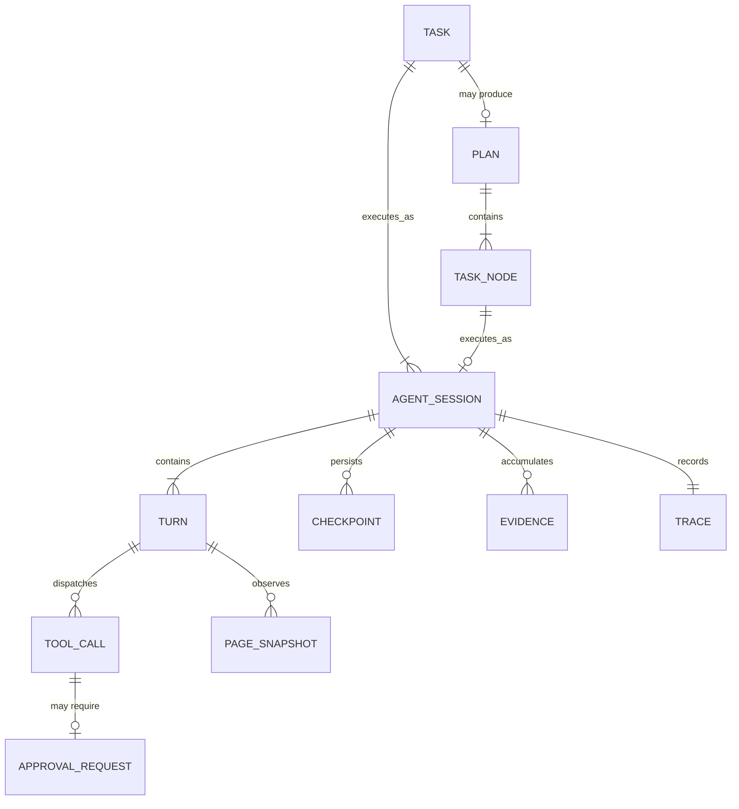
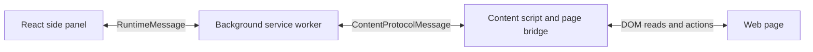
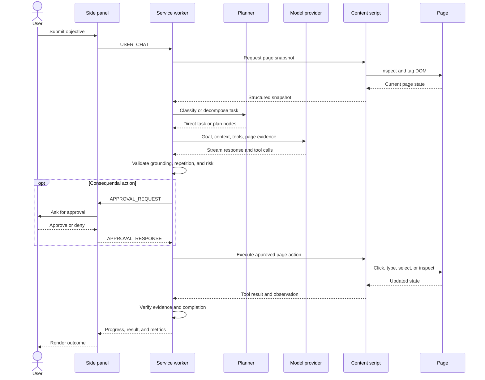
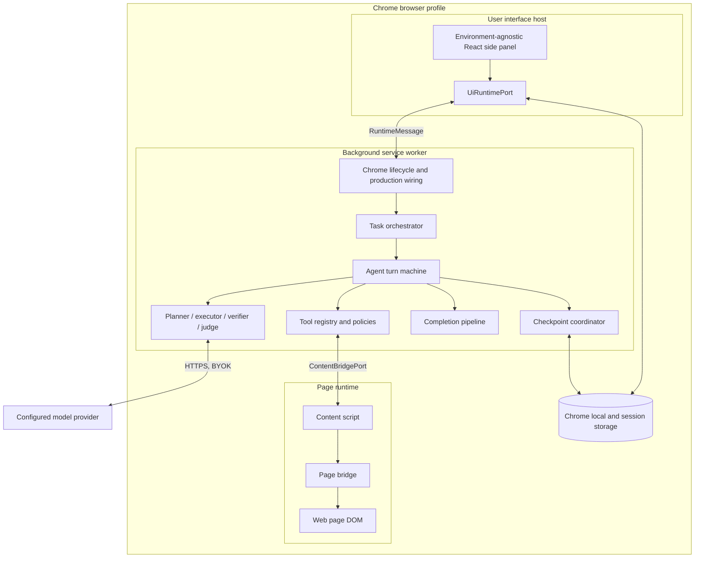
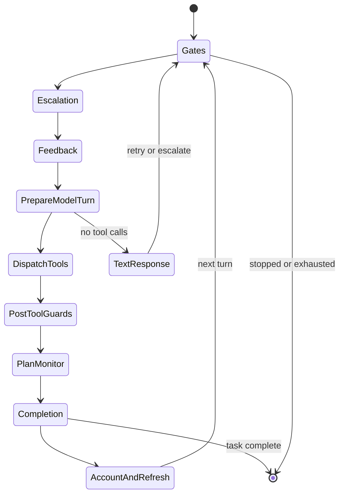
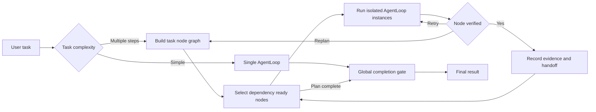
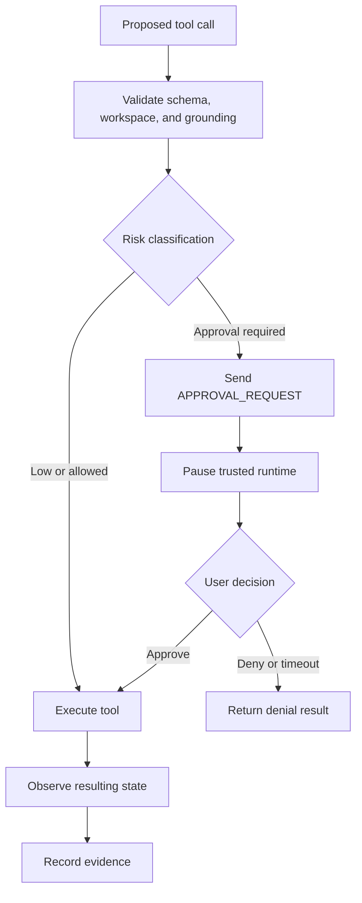
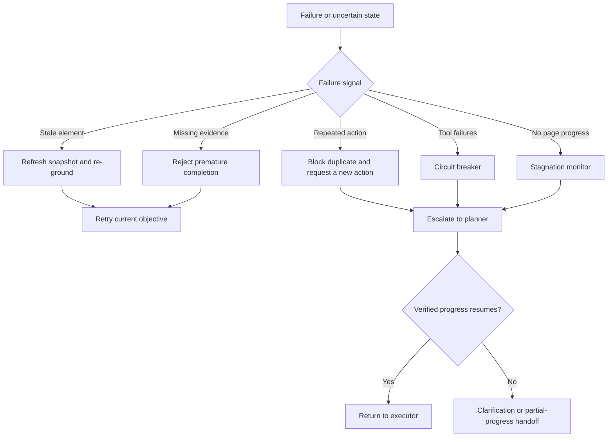
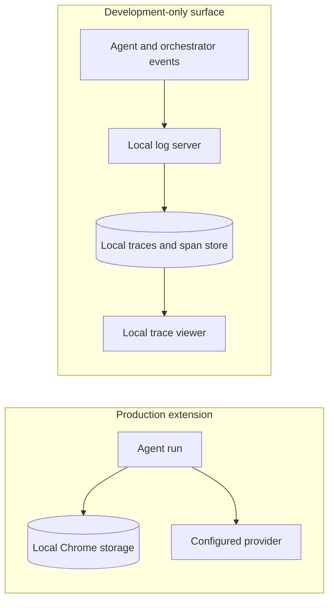

# OpenSidebar: System Design Interview Walkthrough

OpenSidebar is a local-first, bring-your-own-key Chrome extension. A user describes
a browser task in a side panel, and an LLM-powered agent reads and operates the
current website.

This walkthrough presents the current system rather than redesigning it as a hosted
automation service. OpenSidebar has no central API server, model relay, user
database, or first-party telemetry backend.

## 1. Clarify the Requirements — About 5 Minutes

### Functional requirements

Users should be able to:

1. **Execute multi-step browser tasks.** Read pages, click elements, fill forms,
   navigate, and carry information across pages or tabs. Complex objectives may be
   decomposed into smaller steps.
2. **Monitor and control execution.** See plans, progress, model output, tool calls,
   completion evidence, and cost. Pause, resume, stop, or provide feedback while a
   task is running.
3. **Approve consequential actions.** Require explicit approval before high-risk
   operations, then resume after approval, denial, or clarification.

Passive page monitoring, reusable skills, and developer trace analysis are useful
secondary capabilities, but they are not required for the core design.

### Non-functional requirements

- **Safety:** high-risk actions must pass enforceable approval gates.
- **Recoverability:** navigation and Manifest V3 service-worker suspension must not
  silently discard active-task state.
- **Correctness:** completion should be accepted only when supported by observable
  evidence.
- **Privacy:** credentials and settings stay local; page data goes directly to the
  model provider selected by the user.
- **Responsiveness:** progress and streamed output should appear incrementally rather
  than only after a task finishes.

OpenSidebar is supervised automation, not guaranteed unattended automation. Dynamic
pages, cross-origin frames, model outages, provider rate limits, and anti-automation
systems remain expected failure modes.

### Capacity estimation

Traditional global requests-per-second calculations are not the main design driver
because each installation executes inside one browser profile. The useful capacity
questions are instead:

- How much model context can one session retain?
- How often can screenshots and page snapshots be captured without excessive cost?
- How many turns and tool calls should one task be allowed?
- How much checkpoint and diagnostic data can be held in Chrome storage?
- Which browser operations are safe to run concurrently?
- Can the configured provider sustain the request rate and latency of the run?

These constraints motivate sliding-window context management, bounded execution,
checkpointing, selective perception, and constrained parallelism. The default task
limit is 30 turns, with larger user-selectable presets for longer workflows.

## 2. Identify the Core Entities — About 2 Minutes

| Entity | Purpose |
| --- | --- |
| `Task` | The user's overall objective |
| `Plan` | A decomposition of a complex task |
| `TaskNode` | One independently executable plan step |
| `AgentSession` | Execution state for a task or plan node |
| `Turn` | One Think → Act → Observe iteration |
| `PageSnapshot` | Structured and optionally visual page state |
| `ToolCall` | A requested browser operation and its result |
| `ApprovalRequest` | A human gate for a consequential action |
| `Checkpoint` | Recoverable state across navigation or worker restart |
| `Evidence` | Observations demonstrating that an operation succeeded |
| `Trace` | Plans, actions, verification decisions, metrics, and costs |

Runtime state has three relevant lifetimes:

- **Session state:** current tab, plan position, and completion summary.
- **Turn state:** whether the current turn changed the DOM or produced a done signal.
- **Run state:** accumulated failures, recent actions, evidence, and discovered
  elements.



## 3. Define the System Interface — About 5 Minutes

Because this is a browser extension, its primary interface is a typed runtime-message
protocol rather than a public REST API.



Representative operations include:

```text
USER_CHAT {
  workspaceId,
  text,
  isFeedback?
}

USER_CHAT_ACCEPTED {
  workspaceId
}

APPROVAL_REQUEST {
  requestId,
  action,
  risk,
  explanation
}

APPROVAL_RESPONSE {
  requestId,
  approved
}

PAUSE_AGENT
RESUME_AGENT
STOP_AGENT

STREAM_CHUNK {
  text
}

SESSION_METRICS {
  tokens,
  cost,
  modelBreakdown
}
```

Sensitive identity and execution context come from the extension's active workspace
and trusted runtime state. Webpage content must not be able to claim another
workspace or manufacture approval state.

Small internal ports isolate reusable code from Chrome-specific APIs:

- `UiRuntimePort` provides messaging, tabs, windows, permissions, extension URLs,
  keepalive behavior, and storage to the shared React UI.
- `BrowserPagePort` provides browser-page and screenshot operations.
- `ContentBridgePort` carries messages and injection between background and content
  contexts.
- `PersistencePort` stores recoverable local state.

Chrome-backed adapters implement these ports in production. The overlay test harness
supplies in-memory implementations.

## 4. Describe the Data Flow — Up to 5 Minutes



The verifier can accept the result, retry the action, request a new strategy, escalate
from the executor to the planner, ask the user for clarification, or return a
structured partial-progress handoff.

Navigation is a special case: the loop checkpoints its state, permits the page
transition, waits for Chrome's navigation-completion event, restores the checkpoint,
and resumes on the new page.

## 5. Build the High-Level Design — About 10–15 Minutes



### Side panel

The side panel is the user-facing control surface. It displays chat, plans,
progress, approvals, settings, and cost metrics.

React components do not access `chrome.*` directly. They depend on
`UiRuntimePort`, allowing the same UI to run in the production extension and in the
overlay test harness.

### Background service worker

The service worker is the control plane. It owns task classification, agent-loop
execution, model routing, tool dispatch, approval enforcement, checkpointing,
completion verification, and session metrics.

Each agent turn runs through an explicit state machine:



A phase returns a typed outcome: advance to the next phase, begin the next turn, end
the current turn, or end the task. This keeps pause, stop, retry, and completion
behavior explicit.

### Content script and page bridge

The content layer is the webpage-interaction data plane. It inspects and tags
interactive DOM elements, produces structured snapshots, executes actions, and
returns updated observations.

The agent generally operates on tagged elements rather than inventing arbitrary CSS
selectors. Dynamically discovered elements are recorded so subsequent tool calls can
reference them safely.

### Planner and orchestrator

Simple tasks run directly in an `AgentLoop`. Complex tasks are decomposed into
`TaskNode`s with objectives, dependencies, success criteria, and execution
constraints.



The planner plans but does not operate browser tools. The executor performs the
actions. The verifier judges the current node rather than requiring each node to
satisfy the entire user task.

Independent read operations may overlap. Operations that mutate the same page or
shared resource are serialized.

### Completion pipeline

Completion is not accepted merely because a model emits `DONE`. One authoritative
pipeline evaluates the task contract, tool results, page mutations, current evidence,
missing obligations, and optional verifier or judge output.

The pipeline returns a verdict plus effects-as-data. The loop then applies those
effects, such as accepting completion, recording a rejection, retrying, or requesting
more evidence.

### Persistence and providers

Settings and API keys are held in Chrome local storage. Run context can use session
storage so it survives service-worker lifecycle interruptions. Navigation
checkpoints preserve enough state to resume after the current page is replaced.

OpenSidebar sends model requests directly to the user-configured provider over
HTTPS. Separate model seats may handle planning, execution, perception, and judging.
This improves specialization but increases latency, cost, configuration complexity,
and dependence on provider availability.

## 6. Lead the Deep Dives — About 10 Minutes

### Manifest V3 durability

Chrome can suspend an idle service worker, and navigation destroys page-local state.
The design uses session-backed runtime state, navigation checkpoints, a navigation
completion bridge, repetition guards, and structured partial-progress handoffs.

A difficult edge case remains: interruption between an external side effect and
checkpoint persistence. Approval records and post-action evidence reduce this
ambiguity but cannot eliminate it for every website.

### Grounding on dynamic pages

DOM identifiers become stale when an SPA rerenders. Acting on an old element could
target the wrong control. OpenSidebar combines structured DOM snapshots, element
tags, optional screenshots, post-action refreshes, stale-element recovery, and page
fingerprints.

The trade-off is latency and token cost. Refreshing after every micro-operation is
expensive; refreshing too rarely makes grounding unsafe. The runtime batches one
snapshot refresh after a tool group where it is safe to do so.

### Safety and approvals



Approval state belongs to the trusted extension runtime, not the webpage or the
model. Users can also pause, resume, stop, and inject corrective feedback. Navigation
accepts only validated HTTP and HTTPS URLs, and sensitive scripting capabilities
receive additional guards.

### Recovery from model and page failures



Recovery mechanisms include tool-schema validation, repeated-action blocking,
per-tool and consecutive-failure circuit breakers, page-fingerprint stagnation
detection, executor-to-planner escalation, replanning, and maximum-turn limits. The
system favors an honest inability to verify completion over silently declaring
success.

### Privacy and observability

The production extension has no OpenSidebar-hosted analytics or first-party
telemetry endpoint. Keys, settings, and optional reliability summaries remain local.
Page context and screenshots may still be sent to the configured provider, whose
logging, retention, pricing, and compliance policies remain outside OpenSidebar's
control.

For development, a separate local trace pipeline records model calls, tool calls,
screenshots, verification, tokens, and cost. The trace viewer and its ingestion pipe
are excluded from production builds.



## Closing Summary

OpenSidebar's architecture is intentionally local and boundary-first:

```text
Environment-agnostic UI
→ service-worker orchestration
→ grounded content-script actions
→ evidence-based verification
```

The hardest problems are not database sharding or global request throughput. They
are safely coordinating an unreliable model, a dynamic webpage, human approval, and
an interruptible browser-extension runtime.

The basic system uses three Chrome contexts and direct model-provider access.
Checkpointing, context compression, selective perception, constrained concurrency,
escalation, and verification are added specifically to address durability, cost,
safety, and reliability.

The central trade-off is local control and provider choice versus browser lifecycle
constraints and supervised-agent reliability. OpenSidebar deliberately accepts that
trade-off instead of depending on a centralized automation backend.

## Further Reading

- [Architecture overview](overview.md)
- [Agent loop](agent-loop.md)
- [Orchestrator](orchestrator.md)
- [Runtime boundaries](runtime-boundaries.md)
- [Trace viewer](trace-viewer.md)
- [Known limitations](../known-limitations.md)
