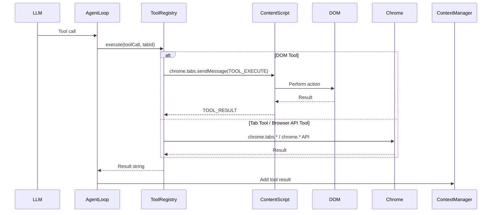

# Tool System

OpenSidebar implements **52 tools** across five categories. Tools are defined in `src/background/tools/index.ts` with metadata in `src/background/tools/metadata.ts`.

## Tool Categories

### DOM Tools (Content Script)

These tools operate in the page context and manipulate the DOM directly.

| Tool                | Description                       | Arguments                                                                    |
| ------------------- | --------------------------------- | ---------------------------------------------------------------------------- |
| `click_element`     | Click an element by tag ID        | `{ id: number }`                                                             |
| `type_text`         | Type text into an input field     | `{ id: number, text: string, pressEnter?: boolean }`                         |
| `scroll_page`       | Scroll the page or container      | `{ direction: "up" \| "down" \| "top" \| "bottom", id?: number }`            |
| `read_page`         | Get a fresh DOM snapshot          | `{}`                                                                         |
| `hover_element`     | Hover over an element             | `{ id: number }`                                                             |
| `find_element`      | Find element by visible text      | `{ text: string }`                                                           |
| `select_option`     | Select a dropdown option          | `{ id: number, value: string }`                                              |
| `press_key`         | Press a keyboard key              | `{ key: string, modifiers?: string[] }`                                      |
| `drag_and_drop`     | Drag an element to a target       | `{ sourceId: number, targetId: number }`                                     |
| `draw_stroke`       | Draw a stroke on a canvas         | `{ id: number, startX: number, startY: number, endX: number, endY: number }` |
| `hide_element`      | Hide an element by ID             | `{ id: number }`                                                             |
| `read_element`      | Read specific attribute or text   | `{ id: number, attribute?: string }`                                         |
| `execute_js`        | Run JavaScript in page context    | `{ code: string }`                                                           |
| `upload_file`       | Upload a file to a file input     | `{ id: number, url: string }`                                                |
| `right_click`       | Right-click on an element         | `{ id: number }`                                                             |
| `set_checkbox`      | Set checkbox/radio state          | `{ id: number, checked: boolean }`                                           |
| `click_coordinates` | Click at viewport X/Y coordinates | `{ x: number, y: number, description?: string }`                             |
| `inspect_hidden`    | Scan for hidden DOM elements      | `{ pattern?: string, maxResults?: number }`                                  |

### Page Assist Tools (Service Worker → MAIN world)

These tools inject scripts into the page's MAIN world via `chrome.scripting.executeScript` to modify page behavior. Both are toggles — call once to enable, again to disable.

| Tool           | Description                                     | Arguments |
| -------------- | ----------------------------------------------- | --------- |
| `xray_page`    | Force all hidden elements visible (CSS override) | `{}`      |
| `fast_forward` | Accelerate page timers to fire instantly         | `{}`      |

**`xray_page`** injects a `<style data-osb-xray>` that overrides `display:none`, `opacity:0`, `visibility:hidden`, and `aria-hidden`. Marked `domModifying: true` so the agent loop refreshes the DOM snapshot after toggling, allowing newly revealed elements to get tagged. Does not persist across navigations.

**`fast_forward`** monkey-patches `setTimeout` and `setInterval` to fire at 10ms max delay. Saves originals on `globalThis.__osb_origTimers` for clean restore on second call. Does not persist across navigations.

### Tab Tools (Service Worker)

These tools use Chrome APIs to manage tabs and navigation.

| Tool              | Description                     | Arguments                                             |
| ----------------- | ------------------------------- | ----------------------------------------------------- |
| `navigate`        | Navigate to URL or search query | `{ url?: string, query?: string }`                    |
| `create_tab`      | Open a new tab                  | `{ url: string }`                                     |
| `close_tab`       | Close a tab                     | `{ tabId?: number }`                                  |
| `switch_tab`      | Switch to a tab by ID           | `{ tabId: number }`                                   |
| `list_tabs`       | List open tabs in workspace     | `{}`                                                  |
| `go_back`         | Go back in browser history      | `{}`                                                  |
| `go_forward`      | Go forward in browser history   | `{}`                                                  |
| `wait`            | Wait for dynamic content        | `{ seconds: number, reason?: string }`                |
| `take_screenshot` | Capture viewport screenshot     | `{}`                                                  |
| `group_tabs`      | Group tabs into a tab group     | `{ tabIds: number[], title: string, color?: string }` |
| `ungroup_tabs`    | Remove tabs from a group        | `{ tabIds: number[] }`                                |
| `create_window`   | Open a new browser window       | `{ url?: string, incognito?: boolean }`               |

### Browser API Tools

These tools interact with browser features like cookies, history, bookmarks, and downloads.

| Tool                | Description                    | Arguments                                                                      |
| ------------------- | ------------------------------ | ------------------------------------------------------------------------------ |
| `get_cookies`       | Get cookies for a URL          | `{ url?: string }`                                                             |
| `set_cookie`        | Set a cookie                   | `{ url: string, name: string, value: string, domain?: string, path?: string }` |
| `delete_cookie`     | Delete a cookie                | `{ url: string, name: string }`                                                |
| `copy_to_clipboard` | Copy text to clipboard         | `{ text: string }`                                                             |
| `read_pdf`          | Extract text from a PDF        | `{ url: string, maxPages?: number }`                                           |
| `search_history`    | Search browser history         | `{ query: string, maxResults?: number }`                                       |
| `create_bookmark`   | Bookmark a page                | `{ title?: string, url?: string, parentId?: string }`                          |
| `get_bookmarks`     | Search bookmarks               | `{ query: string, maxResults?: number }`                                       |
| `download_file`     | Start a file download          | `{ url: string, filename?: string }`                                           |
| `transcribe_audio`  | Transcribe audio/video element | `{ id: number }`                                                               |
| `send_notification` | Show a desktop notification    | `{ title: string, message: string }`                                           |

### Special Tools

These tools control the agent itself or provide memory capabilities.

| Tool            | Description             | Arguments                                                                               |
| --------------- | ----------------------- | --------------------------------------------------------------------------------------- |
| `done`          | Mark task as complete   | `{ summary: string }`                                                                   |
| `escalate`      | Switch to smarter model | `{ reason: string }`                                                                    |
| `memory_add`    | Save to memory          | `{ content: string, category?: string }`                                                |
| `memory_search` | Search memory           | `{ query: string }`                                                                     |

## Tool Execution Flow



## Adding a New Tool

### Step 1: Define the Tool Schema

In `src/background/tools/index.ts`:

```typescript
const MY_NEW_TOOL_DEF: ToolDefinition = {
  type: "function",
  function: {
    name: ToolName.MY_NEW_TOOL,
    description: "Description of what the tool does",
    parameters: {
      type: "object",
      properties: {
        param1: {
          type: "string",
          description: "What this parameter does",
        },
        param2: {
          type: "number",
          description: "Another parameter",
        },
      },
      required: ["param1"],
    },
  },
};
```

### Step 2: Register the Executor

In the same file, register the tool:

```typescript
toolRegistry.register(
  ToolName.MY_NEW_TOOL,
  MY_NEW_TOOL_DEF,
  async (args, tabId, signal) => {
    // Implementation
    return "Result string";
  },
);
```

### Step 3: Add Metadata (Optional)

In `src/background/tools/metadata.ts`:

```typescript
// If tool modifies DOM (triggers snapshot refresh)
DOM_MODIFYING_TOOLS.add("my_new_tool");

// If tool must run alone (not in parallel)
SEQUENTIAL_TOOLS.add("my_new_tool");

// Add to risk classification if needed
```

## Tool Metadata

### DOM_MODIFYING_TOOLS

Tools that modify the DOM and trigger a snapshot refresh after execution:

- `click_element`
- `type_text`
- `scroll_page`
- `hover_element`
- `select_option`
- `drag_and_drop`
- `draw_stroke`
- `hide_element`
- `xray_page`
- `navigate`
- `go_back`
- `go_forward`

### SEQUENTIAL_TOOLS

Tools that must execute alone (not in parallel with others):

- `navigate` - Changes page context
- `done` - Ends the agent loop
- `take_screenshot` - Captures current state
- `escalate` - Changes model
- `go_back` - Changes page context
- `go_forward` - Changes page context

## Risk Classification

Tools are classified by risk level (informational, not enforced):

- **LOW**: Read-only operations or reversible toggles
  - `read_page`, `memory_search`, `scroll_page`, `list_tabs`, `get_cookies`, `search_history`, `get_bookmarks`, `read_element`, `inspect_hidden`, `xray_page`, `fast_forward`
- **MEDIUM**: Mutates page state
  - `click_element`, `type_text`, `hover_element`, `hide_element`, `select_option`, `set_checkbox`, `right_click`, `click_coordinates`
  - `memory_add`, `set_cookie`, `delete_cookie`, `copy_to_clipboard`, `create_bookmark`, `upload_file`
- **HIGH**: Navigation and browser management
  - `navigate`, `create_tab`, `close_tab`, `switch_tab`, `create_window`, `download_file`, `group_tabs`, `ungroup_tabs`, `escalate`

## Tool Result Format

All tools return a string result:

- Success: Descriptive result (e.g., "Clicked element [5]", "Navigated to https://...")
- Error: `"Error: {description}"` (e.g., "Error: No element with tag 5")

## Tool Recovery

If the LLM returns tool calls as plain text instead of structured JSON, the system attempts to recover them:

See `src/background/agent/tool-recovery.ts` for the `recoverToolCallsFromText()` function.

## Testing Tools

```bash
# Run tool-related tests
bun test --grep "tool"

# Test specific tool execution
bun test tests/background/tools.test.ts
```

## Key Files

| File                               | Purpose                        |
| ---------------------------------- | ------------------------------ |
| `src/background/tools/index.ts`    | Tool definitions and executors |
| `src/background/tools/registry.ts` | ToolRegistry class             |
| `src/background/tools/metadata.ts` | Tool metadata (risk, flags)    |
| `src/content/actions.ts`           | DOM tool implementations       |
| `src/background/agent/executor.ts` | Tool execution orchestration   |
