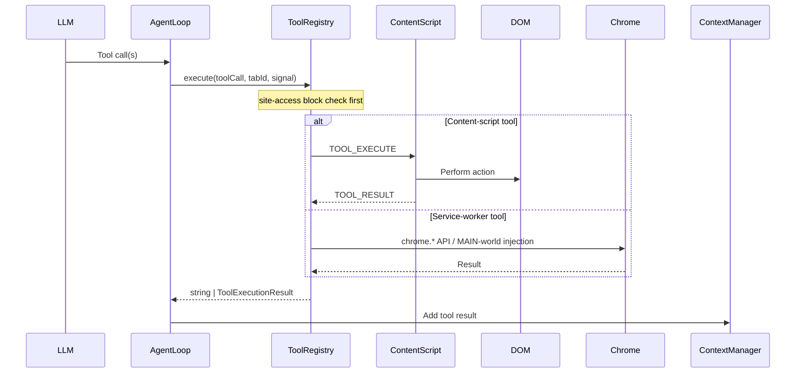

# Tool System

OpenSidebar exposes **52 tools** to the model. The **source of truth** is
`packages/shared-types/src/enums.ts` (`ToolName`) plus the definition/register
modules below — consult those for exact parameter schemas rather than any list
in prose.

## Module structure

`apps/extension/src/background/tools/index.ts` is a ~130-line **barrel**: it
re-exports submodules and wires registration via `registerTools()`. The bulk
lives in:

| Module | Contents |
| --- | --- |
| `definitions.ts` | LLM-facing `ToolDefinition` schemas for generic tools |
| `registry.ts` | `ToolRegistry` — `execute(toolCall, tabId, signal)`, site-access blocking, structured results |
| `metadata.ts` | `TOOL_METADATA`, risk levels, tool profiles, node-concurrency metadata |
| `register-interaction.ts` | click / type / scroll / read / hover / find / select / press / drag / hide / dismiss |
| `register-core-actions.ts` | core page actions |
| `register-tabs.ts` | navigate-adjacent tab management (`create_tab`, `close_tab`, `switch_tab`, `list_tabs`, `go_back`, `wait`, `create_window`) |
| `register-cookies.ts` / `register-history.ts` | cookies, history search |
| `register-inspection.ts` | `inspect_hidden`, `inspect_chart`, `inspect_table`, `inspect_filter_state`, `inspect_region`, `extract_form_state`, `xray_page` |
| `register-scripting-download.ts` | `execute_js`, `upload_file`, `download_file` |
| `register-agent-control.ts` / `register-agent-tools.ts` | `done`, `escalate`, `clarify`, `update_notes`, `update_plan`, `compose_text`, `get_profile_fields` |
| `main-world-bridge.ts` | Serialized MAIN-world injection scripts |
| `download-helpers.ts`, `tab-navigation-helpers.ts`, `page-inspector.ts` | Shared helpers |
| `servicenow/` | Quarantined ServiceNow adapter (see below) |

`navigate` itself is registered inline in `index.ts` because it enforces the
allowed-origins navigation boundary via `tab-navigation-helpers.ts`.

**Registration order is the catalog order presented to the model** — comments
in `index.ts` warn against regrouping the calls.

## ServiceNow adapter (one-way rule)

`tools/servicenow/` owns the SN tool schemas and handlers:
`open_servicenow_module`, `configure_servicenow_form` (`register.ts`),
`search_knowledge_base` (`register-knowledge-base.ts`),
`apply_list_filter/_sort/_action` (`register-list-actions.ts`),
`inspect_catalog_item` / `configure_catalog_item` (`register-catalog.ts`).

Import direction is one-way: adapter modules must **never** import
`tools/index.ts` or the tools barrel — only `helpers` and concrete siblings.
The generic layer reaches SN behavior solely through the `servicenow/register*`
entry points and the `tool-hooks.ts` façade (reference-resolution hooks that
no-op off ServiceNow). See CLAUDE.md for what is and isn't quarantined.

## Conventions

- **Param names must match across three layers**: the `ToolDefinition` schema,
  the TypeScript args type (`packages/shared-types/src/tools.ts`), and the
  implementation in `content/actions/`. Use `id` (integer) for element tag
  IDs — never `tag`.
- Executors return a string (`"Success..."` / `"Error: ..."`) or a structured
  `ToolExecutionResult`; the registry normalizes for the model.
- Content-script tools travel as `TOOL_EXECUTE` / `TOOL_RESULT` messages;
  service-worker tools call Chrome APIs directly; a few inject MAIN-world
  scripts via `chrome.scripting` (`main-world-bridge.ts` — the scripts are
  self-contained serialized functions).

## Tool metadata

`metadata.ts` centralizes per-tool flags in a single
`TOOL_METADATA: Record<ToolName, ToolMeta>` map. The convenience sets
(`DOM_MODIFYING_TOOLS`, `SEQUENTIAL_TOOLS`, `CACHEABLE_TOOLS`,
`MUTATION_SENSITIVE_TOOLS`) are **derived** by filtering that map — to change
a tool's behavior, edit its `ToolMeta` entry, don't `.add()` to a set.

`ToolMeta` fields:

- `domModifying` — triggers a batch DOM-snapshot refresh after the turn's
  tools complete. Note: `navigate` and `go_back` are **not** DOM-modifying
  (navigation has its own refresh path), while `read_page`, `execute_js`,
  `upload_file`, and `dismiss_overlays` are.
- `sequential` — must run alone, never in a parallel batch. This is a wide
  set (~22 tools): navigation/tab tools, `execute_js`, `upload_file`, agent
  control (`done`, `clarify`, `update_plan`, `compose_text`), and the SN
  configure/apply tools.
- `riskLevel` — LOW / MEDIUM / HIGH.
- `cacheable` (`"dom" | "static" | false`) and `mutationSensitive` — drive
  result caching and cache invalidation.

`metadata.ts` also defines **tool profiles** (`TOOL_PROFILES` — `full`,
`read_only`, `form_fill`, `edit_surface`, `navigate`, `enter_code`,
`submit_form`, `inspect_hidden_state`, `recover_from_stuck`,
`navigation_only`) with `resolveToolProfile` / `buildDomAwareProfile`, which
restrict the tool set the model sees per node, and **node-concurrency
metadata** (`TOOL_NODE_CONCURRENCY` with `scope`/`access`) used by the
orchestrator's parallel scheduler.

## Risk classification — enforced

Risk is **not informational**: HIGH-risk tools are gated behind explicit user
approval (`agent/approval-policy.ts` — "high-risk tool requires explicit user
approval"). Notable placements that differ from intuition:

- `get_cookies` and `search_history` are **HIGH** (they read sensitive data).
- `escalate` is **LOW** (a model switch, not a page action).
- Navigation/tab management (`navigate`, `create_tab`, `close_tab`,
  `switch_tab`, `download_file`) is HIGH.

Check `TOOL_METADATA` for any specific tool.

## Tool execution flow



Parallel vs sequential batching, batch snapshot refresh, and circuit breakers
are the agent loop's job — see [Agent Loop](./agent-loop.md).

## Adding a new tool

1. Add the name to `ToolName` (`packages/shared-types/src/enums.ts`) and an
   args type in `packages/shared-types/src/tools.ts`.
2. Add the `ToolDefinition` schema to `definitions.ts` (or the SN adapter's
   `servicenow/definitions.ts`).
3. Register the executor in the appropriate `register-*.ts` module (create the
   grouping that fits; keep registration order deliberate).
4. Add a `ToolMeta` entry to `TOOL_METADATA` in `metadata.ts` (risk,
   domModifying, sequential, cacheable) and, if the orchestrator may schedule
   it in parallel work, a `TOOL_NODE_CONCURRENCY` entry.
5. If it's a content-script tool, implement the action in
   `content/actions/` with matching param names.

## Tool recovery

If the LLM emits tool calls as plain text instead of structured JSON,
`recoverToolCallsFromText()` (`agent/tool-recovery.ts`) attempts recovery
before the turn is treated as text-only.

## Testing

```bash
pnpm exec vitest run --config apps/extension/vitest.config.ts apps/extension/tests/background/tools.test.ts
```

## Key files

| File | Purpose |
| --- | --- |
| `apps/extension/src/background/tools/index.ts` | Barrel + `registerTools()` wiring + `navigate` |
| `apps/extension/src/background/tools/definitions.ts` | Generic tool schemas |
| `apps/extension/src/background/tools/registry.ts` | `ToolRegistry` |
| `apps/extension/src/background/tools/metadata.ts` | Metadata, risk, profiles, concurrency |
| `apps/extension/src/background/tools/servicenow/` | Quarantined SN adapter |
| `apps/extension/src/content/actions/` | DOM tool implementations |
| `apps/extension/src/background/agent/loop.ts` | Dispatch orchestration |
