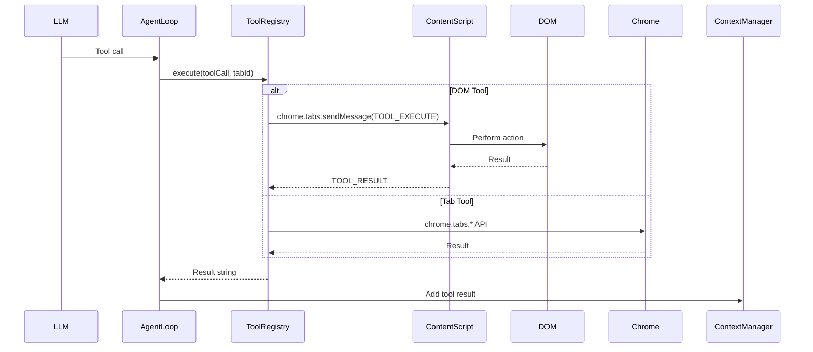

# Tool System

OpenSidebar implements 22 tools across three categories. Tools are defined in `src/background/tools/index.ts` with metadata in `src/background/tools/metadata.ts`.

## Tool Categories

### DOM Tools (Content Script)

These tools operate in the page context and manipulate the DOM directly.

| Tool            | Description                   | Arguments                                                     |
| --------------- | ----------------------------- | ------------------------------------------------------------- |
| `click_element` | Click a tagged element by ID  | `{ id: number }`                                              |
| `type_text`     | Type text into an input field | `{ id: number, text: string, pressEnter?: boolean }`          |
| `scroll_page`   | Scroll the page               | `{ direction: "up" \| "down", amount?: number, id?: number }` |
| `read_page`     | Get a fresh DOM snapshot      | `{}`                                                          |
| `hover_element` | Hover over an element         | `{ id: number }`                                              |
| `find_element`  | Find element by text content  | `{ text: string }`                                            |
| `select_option` | Select a dropdown option      | `{ id: number, option: string }`                              |
| `press_key`     | Press a keyboard key          | `{ key: string, modifiers?: string[] }`                       |
| `drag_and_drop` | Drag an element to a target   | `{ sourceId: number, targetId: number }`                      |
| `draw_stroke`   | Draw a stroke on a canvas     | `{ id: number, strokes: { x1, y1, x2, y2 }[] }`               |
| `hide_element`  | Hide an element by ID         | `{ id: number }`                                              |

### Tab Tools (Service Worker)

These tools use Chrome APIs to manage tabs and navigation.

| Tool              | Description                 | Arguments           |
| ----------------- | --------------------------- | ------------------- |
| `navigate`        | Navigate to a URL           | `{ url: string }`   |
| `create_tab`      | Open a new tab              | `{ url?: string }`  |
| `close_tab`       | Close the current tab       | `{}`                |
| `switch_tab`      | Switch to a tab by ID       | `{ tabId: number }` |
| `wait`            | Wait for a duration         | `{ ms: number }`    |
| `take_screenshot` | Capture viewport screenshot | `{}`                |

### Special Tools

These tools control the agent itself or provide memory capabilities.

| Tool            | Description             | Arguments                           |
| --------------- | ----------------------- | ----------------------------------- |
| `done`          | Mark task as complete   | `{ summary: string }`               |
| `escalate`      | Switch to smarter model | `{ reason?: string }`               |
| `memory_add`    | Save to memory          | `{ content: string }`               |
| `memory_search` | Search memory           | `{ query: string, limit?: number }` |
| `pause_agent`   | Pause agent execution   | `{}`                                |
| `resume_agent`  | Resume agent execution  | `{}`                                |

## Tool Execution Flow



## Adding a New Tool

### Step 1: Define the Tool Schema

In `src/background/tools/index.ts`:

```typescript
{
  name: "my_new_tool",
  description: "Description of what the tool does",
  parameters: {
    type: "object",
    properties: {
      param1: {
        type: "string",
        description: "What this parameter does"
      },
      param2: {
        type: "number",
        description: "Another parameter"
      }
    },
    required: ["param1"]
  }
}
```

### Step 2: Register the Executor

In the same file, register the tool:

```typescript
toolRegistry.register(
  ToolName.MY_NEW_TOOL,
  {
    name: "my_new_tool",
    description: "...",
    parameters: { ... }
  },
  async (args, tabId, signal) => {
    // Implementation
    return "Result string";
  }
);
```

### Step 3: Add Metadata (Optional)

In `src/background/tools/metadata.ts`:

```typescript
// If tool modifies DOM (triggers snapshot refresh)
DOM_MODIFYING_TOOLS.add("my_new_tool");

// If tool must run alone (not in parallel)
SEQUENTIAL_TOOLS.add("my_new_tool");

// Add to risk classification if needed
```

## Tool Metadata

### DOM_MODIFYING_TOOLS

Tools that modify the DOM and trigger a snapshot refresh after execution:

- `click_element`
- `type_text`
- `scroll_page`
- `hover_element`
- `select_option`
- `drag_and_drop`
- `draw_stroke`
- `hide_element`
- `navigate`

### SEQUENTIAL_TOOLS

Tools that must execute alone (not in parallel with others):

- `navigate` - Changes page context
- `done` - Ends the agent loop
- `take_screenshot` - Captures current state
- `escalate` - Changes model

## Risk Classification

Tools are classified by risk level (informational, not enforced):

- **LOW**: Read-only operations
  - `read_page`, `memory_search`, `scroll_page`
- **MEDIUM**: Mutates page state
  - `click_element`, `type_text`, `hover_element`
  - `hide_element`, `select_option`
  - `memory_add`
- **HIGH**: Navigation and tab management
  - `navigate`, `create_tab`, `close_tab`, `switch_tab`
  - `escalate`

## Tool Result Format

All tools return a string result:

- Success: Descriptive result (e.g., "Clicked element [5]", "Navigated to https://...")
- Error: `"Error: {description}"` (e.g., "Error: No element with tag 5")

## Tool Recovery

If the LLM returns tool calls as plain text instead of structured JSON, the system attempts to recover them:

See `src/background/agent/tool-recovery.ts` for the `recoverToolCallsFromText()` function.

## Testing Tools

```bash
# Run tool-related tests
bun test --grep "tool"

# Test specific tool execution
bun test tests/background/tools.test.ts
```

## Key Files

| File                               | Purpose                        |
| ---------------------------------- | ------------------------------ |
| `src/background/tools/index.ts`    | Tool definitions and executors |
| `src/background/tools/registry.ts` | ToolRegistry class             |
| `src/background/tools/metadata.ts` | Tool metadata (risk, flags)    |
| `src/content/actions.ts`           | DOM tool implementations       |
| `src/background/agent/executor.ts` | Tool execution orchestration   |
