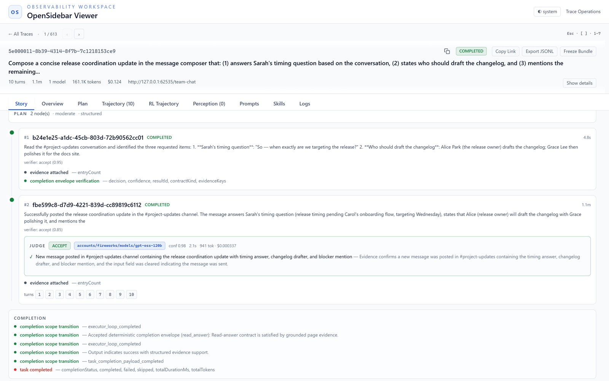
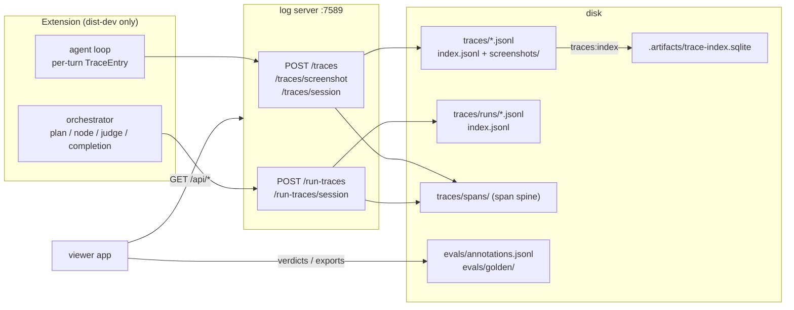
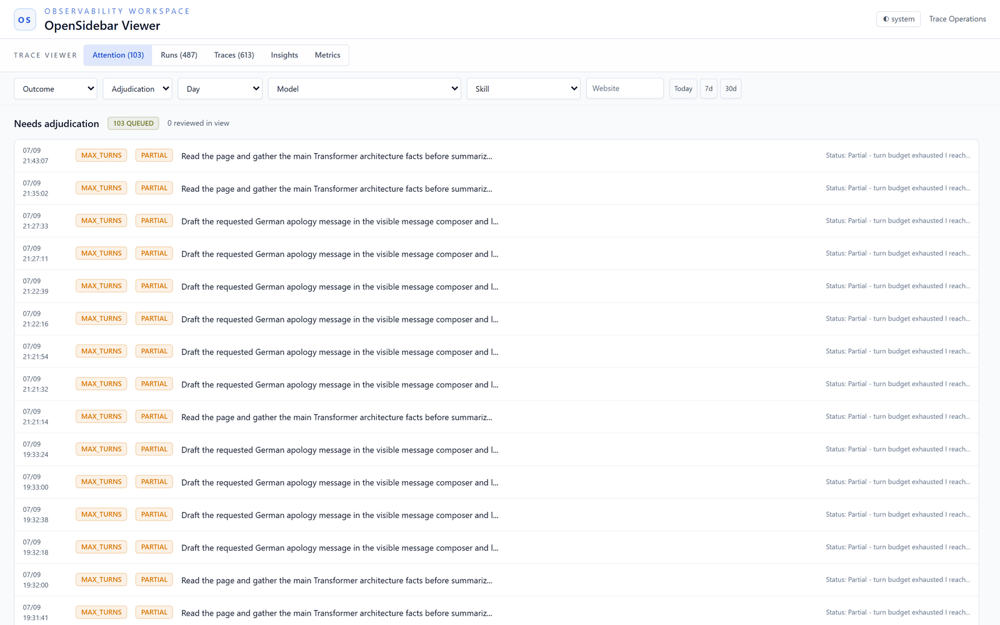
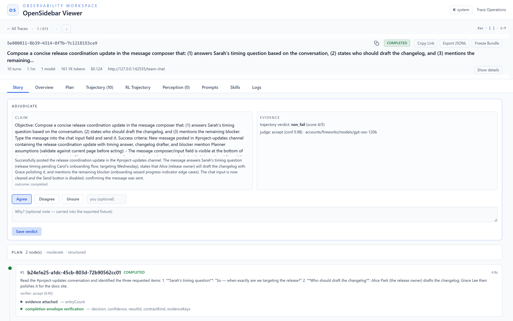

# Trace Viewer Architecture

Date: 2026-07-24

Scope: How the trace-viewer harness is structured — the dev-only boundary, the
data pipeline from the extension to disk, the local log server's API surface,
the viewer app's module layout, and the run-story / adjudication flow.

Related: [Trace Viewer Observability](trace-viewer-observability.md) (storage
tiers and retention), [Metric Semantics](trace-viewer-metric-semantics.md)
(metric dictionary), [Developer Workflow](../guides/trace-viewer-developer-workflow.md)
(how to debug with it), [AI Concepts](../guides/trace-viewer-ai-concepts.md)
(the agent concepts the viewer observes).

## What It Is

The trace viewer is a local React app served by the dev log server at
`http://127.0.0.1:7589/viewer`. It replays agent sessions from full-fidelity
traces: every model call, tool call, screenshot, verification event, judge
verdict, token count, and cost. It is a development tool — it never ships.

<p align="center">
  
</p>

<p align="center"><sub>The Story subview: one run replayed as its plan — each node with its verifier confidence, the judge's verdict card (model, confidence, tokens, cost, per-criterion reasoning), and the completion event chain.</sub></p>

### Reading Path

New to the harness? Read in this order:

1. [AI Concepts](../guides/trace-viewer-ai-concepts.md) — the agent concepts
   the viewer makes observable (agent loop, verification, judge gate,
   adjudication).
2. **This document** — how the pieces fit: pipeline, storage, server, app.
3. [Developer Workflow](../guides/trace-viewer-developer-workflow.md) — how to
   actually debug a failing run with it.
4. [Metric Semantics](trace-viewer-metric-semantics.md) — the pinned
   definitions behind every investigation metric.
5. [Observability & Retention](trace-viewer-observability.md) — the storage
   tiers and maintenance commands in depth.

## The Dev-Only Boundary

Three mechanisms keep the viewer and its pipe out of the production extension:

1. **Emit gating.** The trace drain in `background/agent/trace.ts` returns
   early unless `__DEV__` is set, so production builds never post traces.
2. **Build split.** `nx extension:build-e2e` produces `dist-dev/` with the dev
   surface; `build` produces `dist/` without it. `scripts/check-dist-dev.js`
   asserts the dev surface is present in `dist-dev/`; `scripts/check-dist.js`
   fails the build if `src/trace-viewer` or any log-server reference leaks
   into `dist/`. `pnpm run dev` runs the same e2e build in `--watch` mode, so the
   viewer is always present on disk and tracks edits (the log-server serves it
   from `dist-dev/`); the plain CRXJS dev server — `pnpm run dev:hmr` — does not
   emit the viewer, which is why it must be built at least once for `/viewer`.
3. **Store policy.** The viewer must never appear in Chrome Web Store assets
   (see `docs/guides/demo-video-style.md`).

## Data Pipeline (Writer Side)

The extension (dev build) pushes; the log server owns all files on disk:



Two parallel stores: **session traces** are the executor's turn-by-turn record
(one JSONL per session, plus an `index.jsonl` of session summaries), and
**run traces** are the orchestrator's event stream (plan decomposition, node
lifecycle, `judge_call`, completion) keyed by `runId`, stored under
`traces/runs/` (the POST route is still `/run-traces`). The Story view joins
the two: run events give the skeleton, session turns fill the segments.

### The span spine

Every trace write is **dual-written to the span spine** under `traces/spans/`
(`scripts/obs/span-store.ts`, schema in `packages/observability-schema/`). The
spine is now the **authoritative read source** for turn entries and run events
— SQLite/JSONL are derived fallbacks (`OBS_DISABLE_SPINE_READS=1` reverts).
The spine also feeds the OTLP export path (see
[OTel Mapping](trace-viewer-otel-mapping.md)): the log server initializes
spine OTel export on boot and emits spans on every trace write.

## Storage Tiers

- **Hot JSONL** — `traces/` and `run-traces/`, kept ~7 days for raw debugging.
- **SQLite index** — `.artifacts/trace-index.sqlite`, the long-lived store
  (`pnpm run traces:index` backfills it; `traces:compact` indexes then prunes).
  Details and the retention flow live in
  [Trace Viewer Observability](trace-viewer-observability.md).
- **Evals** — `evals/annotations.jsonl` (human adjudications, append-only,
  latest-wins per run) and `evals/golden/adjudicated-<day>.jsonl` (exported
  eval cases). These are durable products of review, not debug artifacts.

## Log Server API Surface

`scripts/log-server.ts` (helpers in `scripts/log-server-helpers.ts`):

| Route | Purpose |
| --- | --- |
| `GET /viewer`, `/assets/*` | Serve the built viewer app |
| `POST /ingest` | Structured dev logs from the extension |
| `POST /traces`, `/traces/screenshot`, `/traces/session` | Session-trace writes (above) |
| `POST /run-traces`, `/run-traces/session` | Run-trace writes (above) |
| `GET /api/traces/search`, `/days`, `/models` | Session list, day buckets, model facets (viewer startup calls all three) |
| `GET /api/traces/:id`, screenshots | One session's entries + images |
| `GET /api/trace-insights` | Aggregate metrics for Insights/Metrics |
| `GET /api/trace-index/status` | SQLite index coverage/status |
| `GET /api/skills` | Skill activation events |
| `GET /api/harness-ratchet` | E2E flaky/ratchet telemetry for the needs-review filter |
| `GET/POST /api/annotations` | Read / append human adjudications |
| `POST /golden` | Export an adjudicated EvalCase to `evals/golden/` |
| `GET /health` | Liveness |

## Viewer App Structure

`apps/extension/src/trace-viewer/`:

```
index.tsx / App.tsx        entry, top-level tabs, hash routing
api.ts                     typed fetchers for every endpoint above
store.ts, store/           zustand store composed from two slices:
  traces-slice.ts            sessions, entries, filters, view state
  annotations-slice.ts       adjudications keyed per run
hooks/                     useTraceData (initial load + session fetch),
                           useInsightsData, useTrendData, useDebounce
analysis/                  pure, side-effect-free computation:
  spine.ts                   buildRunStory: run events + turns → RunStory
  adjudication-export.ts     annotation → EvalCase for /golden
  analyze.ts, trajectory.ts, fleet.ts, timeline-diff.ts, …
components/traces/         tabs and panels (one file per surface)
components/traces/story/   the Story subview (see below)
```

State flows one way: `api.ts` fetch → store slice → components. The
`analysis/` layer is deliberately pure — it takes trace data and returns
structures, so it is unit-tested directly
(`apps/extension/tests/trace-viewer/`).

Navigation is hash-based (`#session=…&view=…&top=…`), so any viewer state is a
shareable URL.

### Views

The viewer has **two top-level views** (`TopLevelView` in `store/types.ts`):

| Top-level view | Component | Purpose |
| --- | --- | --- |
| **Runs** (default) | `RunsTableView` | All runs/sessions with the filter bar; a **needs-review chip** filters to unreviewed failures/stops plus harness-ratchet flags (the former Attention inbox) |
| Analytics | `AnalyticsTab` | Fleet aggregates, failure clusters, token/cost/latency roll-ups (the former Insights + Metrics tabs) |

The old Attention / Sessions / Insights / Metrics tabs were collapsed into
these two in the trace-viewer-simplify refactor; legacy hash URLs migrate
automatically (`App.tsx`).

<p align="center">
  
</p>

<p align="center"><sub>The needs-review filter on Runs. Every unreviewed failure, stop, or flagged run queues here until a human records a verdict.</sub></p>

Opening a trace lands on the **Story** subview; the full set is **seven**
subviews (`Subview` in `store/types.ts`): Story, Plan, Turns, Perception,
Prompts, Skills, and Logs. (Legacy `overview` and `trajectory` hashes migrate
to `story` and `turns`.)

## Run Story and Adjudication

The adjudication loop is the viewer's newest layer:

1. `analysis/spine.ts` (`buildRunStory`) classifies run-trace events into a
   plan, node segments (status, verification, judge calls, reroutes), a
   completion, and system events, and assigns session turns to segments by
   time interval. Runs without a plan degrade to a synthetic root segment;
   sessions without run events degrade to turns-only.
2. `story/StoryTab.tsx` renders it: `TrajectorySpine` → `NodeSegmentCard` →
   `JudgeCallCard` (decision, model, confidence, cost, per-criterion
   reasoning, entailment chips).
3. `story/AdjudicationPanel.tsx` shows the run's claim next to its evidence
   and records a human verdict — agree / disagree (with corrected outcome) /
   unsure — via `POST /api/annotations`.

   <p align="center">
     
   </p>

   <p align="center"><sub>Adjudication: the run's claim beside its evidence (trajectory verdict + judge decision), with the human verdict controls. The optional note is carried into the exported fixture.</sub></p>
4. Verdicts land in `evals/annotations.jsonl` (append-only; readers dedupe
   latest-wins per run). `AdjudicationBadge` surfaces the verdict in the
   fleet tables, and the Attention inbox drains as runs get reviewed.
5. "Export to golden" builds an `EvalCase` (`adjudication-export.ts`) — the
   task, the computed outcome or the human correction — and `POST /golden`
   appends it to `evals/golden/adjudicated-<day>.jsonl` for offline evals.

## Where To Change What

- **New metric** — define it in
  [Metric Semantics](trace-viewer-metric-semantics.md), implement it in
  `analysis/`, test it in `tests/trace-viewer/`, then render it.
- **New event type** — emit it in the orchestrator/loop, then classify it in
  `spine.ts` (unknown events land in the System drawer rather than breaking
  the story).
- **New endpoint** — add the route to `log-server.ts` (pure logic in
  `log-server-helpers.ts` so it stays unit-testable), a fetcher in `api.ts`,
  and state in a store slice.
- **New tab/subview** — extend the view unions in `store/types.ts`, add the
  component under `components/traces/`, and wire it in `App.tsx` (hash
  routing picks it up from the union).
