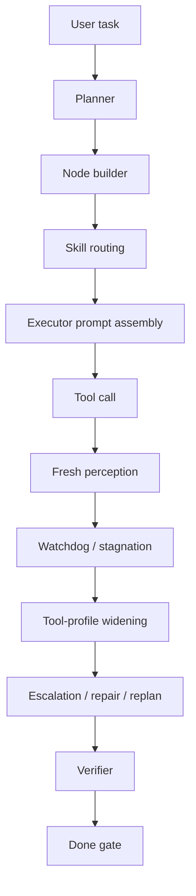
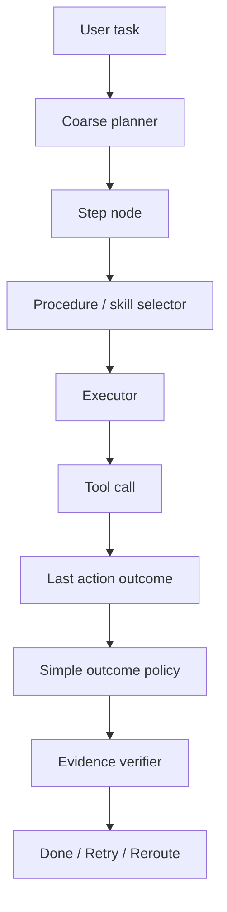
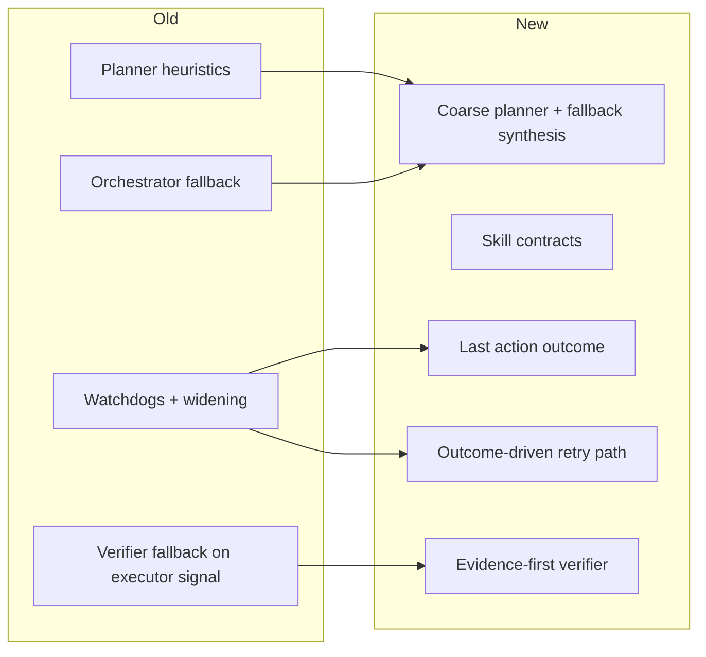

# Harness Transformation: From Thick Loop to Procedure-Guided Execution

Date: 2026-04-15

This article explains the recent harness refactor across six phases, why it was needed, and what the architecture looks like now.

The short version:
- the loop now carries explicit action-outcome state
- completion is more evidence-first
- workflow behavior is more skill-owned
- planner fallback is less ad hoc
- executor handoff is smaller and more local

## Why This Work Happened

The earlier harness worked, but the traces showed a recurring pattern:
- actions happened without a clean summary of their effect
- recovery logic was split across multiple overlapping mechanisms
- the verifier could still over-trust `done()` during provider failures
- the planner and orchestrator still owned too much workflow behavior directly
- fallback planning sometimes degraded into "give the executor the raw user query"

That combination produced a medium-thick harness: capable, but harder to reason about and more expensive than necessary.

## Before

The old control flow looked roughly like this:



Practical problems in that version:
- action feedback was inferred indirectly from a fresh snapshot
- recovery policy lived in several places
- some completion decisions depended too much on model availability
- workflow semantics were split between planner heuristics and skills
- fallback planning could become too literal

## After

The new control flow is narrower:



The important architectural shift is this:
- planner owns coarse decomposition and fallback synthesis
- skills own more workflow discipline
- verifier owns evidence-first completion
- the executor sees a compact local state instead of a bloated global handoff

## The Six Phases

## Phase 1: Explicit Action Outcome

The loop now records a normalized `lastActionOutcome` and feeds it into the next executor turn.

Key idea:
- do not make the model rediscover "what happened" from scratch every turn

What changed:
- the agent context gained structured last-action state
- executor prompts gained a dedicated `Last Action Outcome` section
- existing effect/stagnation signals were normalized instead of staying implicit

Effect:
- lower chance of repeating ineffective actions
- easier local reasoning after a click, type, or submit

Conceptually:

```text
Before: tool call -> re-perceive everything -> infer what changed
After:  tool call -> summarize what changed -> reason from that delta
```

## Phase 2: Outcome-Driven Zero-Effect Recovery

The first no-effect DOM action now warns. The second escalates consistently.

Key idea:
- recovery should be one readable policy, not several partially overlapping ones

What changed:
- zero-effect handling moved closer to the action-outcome path
- repeated no-effect actions now converge faster into replan/escalation behavior

Effect:
- fewer "keep poking the same stale UI" loops
- clearer transition from local retry to higher-level recovery

## Phase 3: Skills Became Execution Contracts

Workflow skills are no longer just labels with loose prose. They now carry structured execution guidance:
- sequencing
- tool discipline
- completion checks
- failure recovery

Examples:
- `structured-form-fill`
- `transactional-act-check-act`
- `cross-tab-compare`
- `hover-reveal-navigation`
- `continuation-edit`

Effect:
- more workflow behavior moved out of generic harness logic
- handoff became more procedure-guided and less purely heuristic

This is the main move toward a thinner harness and fatter skills.

## Phase 4: Executor Context Was Trimmed

The executor no longer receives as much generic spillover in each handoff.

What changed:
- fewer retained artifacts
- empty sections are omitted
- the original query is compacted instead of dumped wholesale
- step-local context takes precedence over broad historical context

Effect:
- less prompt mass
- less drift into irrelevant earlier instructions
- cheaper turns

Conceptually:

```text
Before: current step + broad task + broad history + repeated policy
After:  current step + selected skill + compact task state + local reality checks
```

## Phase 5: Evidence-First Verification

This was one of the most important correctness changes.

Before:
- verifier outages could still fall back to accepting `executorOutcome === "completed"`

After:
- deterministic evidence is checked first
- mutation-sensitive steps require stronger evidence
- read/report tasks still have a narrower text-aligned fallback

That means the verifier now distinguishes between:
- read/report completion that can be supported by aligned content
- action-sensitive completion that needs stronger proof

Examples of action-sensitive steps:
- checkout
- submit
- place order
- delete
- confirm

Examples of read/report steps:
- summarize page
- extract a value
- report a count

Conceptually:

```text
Before:
  if verifier fails and executor says done -> probably accept

After:
  if verifier fails:
    1. use deterministic evidence if available
    2. require stronger proof for risky action steps
    3. allow narrow aligned fallback only for read/report steps
```

## Phase 6: Planner Simplification

The planner was not expanded. It was simplified.

The most important slice:
- fallback planning moved into the planner module itself

Before:
- planner failure in the orchestrator could degrade into a raw single-node executor objective copied from the original query

After:
- planner fallback uses shared synthesis:
  - compact exhaustive fallback when applicable
  - task-contract fallback when the request implies structured retrieval
  - otherwise one normalized fallback step

This matters because raw-query fallback is the opposite of a thin harness. It leaks user phrasing directly into execution control.

Now the fallback path is still simple, but it is planner-owned and normalized.

## Responsibility Shift

Before:

```text
Planner:
  decomposition
  workflow semantics
  some tool semantics
  some completion semantics

Harness:
  watchdogs
  widening
  retries
  repair
  verifier fallback
  planner failure fallback

Skills:
  mostly descriptive guidance
```

After:

```text
Planner:
  coarse decomposition
  fallback node synthesis
  success-criteria shaping

Harness:
  execution loop
  action-outcome propagation
  smaller retry/escalation policy
  safety and scheduling
  evidence-first verification

Skills:
  workflow contracts
  sequencing guidance
  completion expectations
  recovery guidance
```

## Concrete Architectural Delta



## What Improved

## 1. Correctness

- completion is less likely to succeed on weak evidence
- planner failure no longer drops straight into a raw mega-objective
- mutation steps are treated more carefully than read steps

## 2. Trace Readability

- last-action state is explicit
- recovery transitions are easier to interpret
- skill guidance is clearer and more structured

## 3. Cost and Prompt Discipline

- executor prompts are smaller
- less repeated policy text
- less unnecessary global context in the hot path

## 4. Architectural Coherence

- planner is more clearly a planner
- verifier is more clearly an evidence gate
- skills are more clearly workflow contracts

## What Did Not Change

This is important:
- tools are still generic
- the orchestrator still owns scheduling and isolation
- the system is still a hybrid, not a pure "skills only" runtime
- there is still room to simplify further

So this is not a total redesign. It is a directed narrowing of responsibilities.

## Remaining Gaps

The harness is thinner than before, but not minimal yet.

Remaining likely next steps:
- push more completion checks into deterministic per-skill evidence
- continue simplifying retry and escalation interactions
- keep reducing planner-specific workflow heuristics where skills can own them
- develop stronger procedure memory alongside the skill layer

## File-Level Anchors

The main work landed across these areas:
- planner core: `apps/extension/src/background/agent/planner.ts`
- planner-owned fallback graph: `apps/extension/src/background/orchestrator/planner.ts`
- skill contracts and selection: `apps/extension/src/background/orchestrator/skills.ts`
- compact executor handoff: `apps/extension/src/background/orchestrator/handoff.ts`
- action outcome and loop recovery: `apps/extension/src/background/agent/context.ts`, `apps/extension/src/background/agent/loop.ts`
- evidence-first verifier: `apps/extension/src/background/orchestrator/verifier.ts`

## Final Assessment

The transformation did not make the harness "smarter" by piling on more logic. It made it more legible.

That is the real improvement:
- explicit local state
- smaller and clearer control transitions
- stronger evidence gates
- fewer ad hoc fallback paths

In practice, the harness now behaves more like:

```text
plan coarsely -> select procedure -> act -> read explicit outcome -> verify with evidence
```

and less like:

```text
plan -> act -> re-read everything -> guess what happened -> trigger overlapping recovery systems -> hope done is correct
```

That is a meaningful architectural step toward a thinner harness with stronger procedure guidance.
