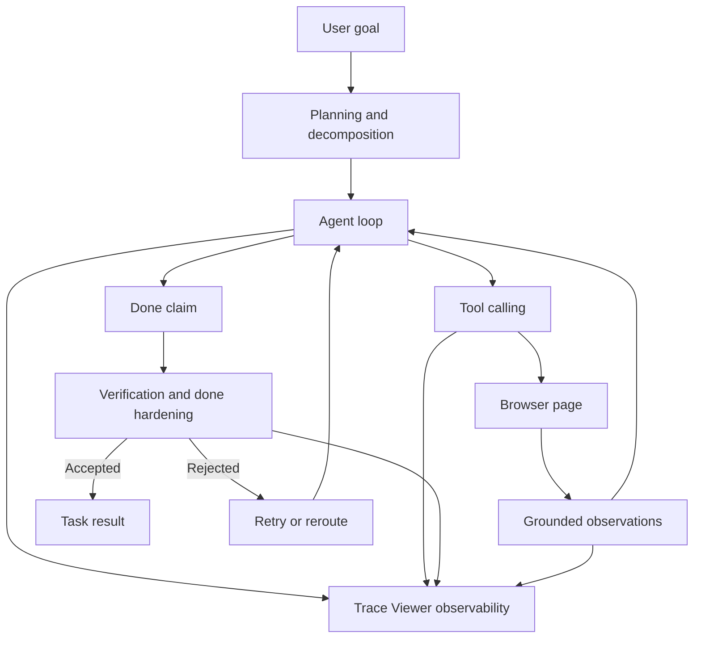

# Trace Viewer AI Concepts

This page summarizes the AI concepts used by OpenSidebar and how the Trace Viewer helps make those concepts observable.

## Agent Loop

OpenSidebar uses a think-act-observe loop. The model receives the user goal and current context, chooses a browser tool, observes the result, and continues until the task is complete.

Why it matters:

- Turns the LLM from a text generator into a browser operator.
- Supports multi-turn workflows across changing page state.
- Creates a need for loop limits, stuck detection, and completion checks.

## Tool Calling

The model acts through structured tools such as reading the page, clicking elements, typing text, navigating, downloading, and calling `done`.

Why it matters:

- Keeps model actions constrained and inspectable.
- Makes failures easier to debug because every action has a typed call and result.
- Lets the runtime validate, record, and retry actions.

## Grounding

The agent grounds decisions in actual browser evidence: DOM snapshots, tagged elements, visible text, URLs, titles, tool results, and perception data when available.

Why it matters:

- Reduces hallucinated actions and answers.
- Lets completion be checked against real page state.
- Helps the agent recover when page state differs from its assumptions.

## Planning And Decomposition

Complex tasks can be decomposed into smaller nodes. Each node has an objective, success criteria, dependencies, allowed tools, and verification.

Why it matters:

- Makes long workflows easier to execute and verify.
- Keeps failures scoped to a single step.
- Allows the orchestrator to retry or reroute only the failed part.

## Verification

The app verifies whether completed work actually satisfies the task. Some checks are programmatic, and ambiguous cases can use an LLM verifier.

Why it matters:

- Reduces false success.
- Separates "the agent took an action" from "the user's goal was met."
- Helps prevent a subtask from being judged against the wrong full-task scope.

## Done Hardening

Calling `done` is treated as a completion claim, not proof. The runtime checks summaries, pending UI state, task contracts, grounding evidence, and workflow-specific requirements before accepting completion.

Why it matters:

- Blocks premature completion.
- Catches cases where the agent only reached an intermediate page.
- Makes final task results more deterministic.

## Skills

Skills encode reusable workflow guidance for repeated browser tasks, such as list filtering, sorting, form filling, catalog ordering, search answer extraction, and multi-tab checklist work.

Why it matters:

- Reduces prompt bloat.
- Makes repeated workflow behavior more consistent.
- Keeps reusable browser-agent knowledge out of test fixtures.

## Retry And Reroute

When verification fails, the orchestrator can retry with failure context or reroute into a repaired objective.

Why it matters:

- Turns failure evidence into useful context.
- Improves resilience on dynamic websites.
- Avoids restarting the entire task when one step fails.

## Context Management

The runtime preserves important context such as the original user goal, recent messages, tool results, and handoff evidence while keeping prompts within token limits.

Why it matters:

- Reduces goal amnesia.
- Controls cost and latency.
- Keeps long-running tasks focused on the original request.

## Perception

The runtime can include perception data from screenshots or visual interpretation alongside DOM-based observations.

Why it matters:

- Helps on pages where the DOM alone is incomplete or misleading.
- Gives the agent additional evidence for visual workflows.
- Adds cost and latency, so traces record when perception is used.

## Observability

The Trace Viewer records model calls, tool calls, tool results, verification events, perception data, tokens, cost, latency, and outcomes.

Why it matters:

- Makes AI behavior debuggable.
- Helps identify whether a failure came from planning, grounding, tool execution, verification, or completion.
- Supports regression testing and runtime hardening.

## Concept Map

